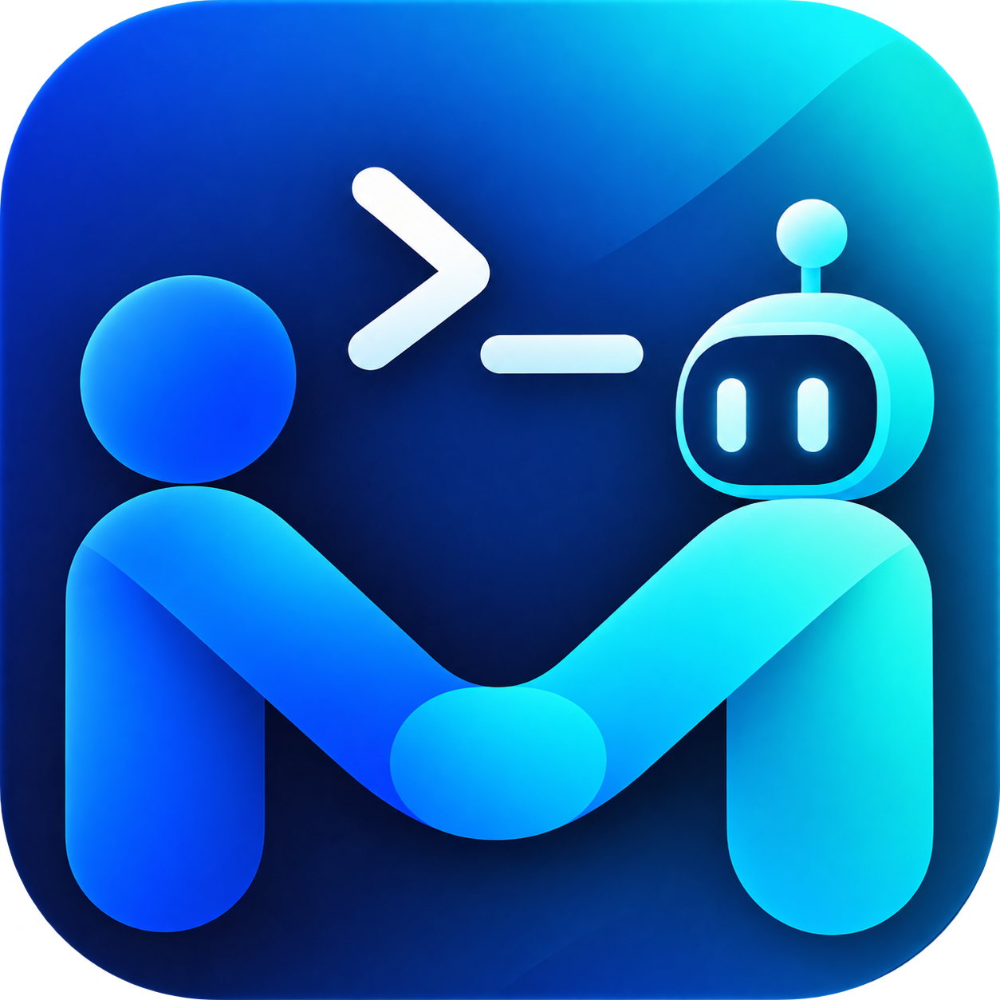
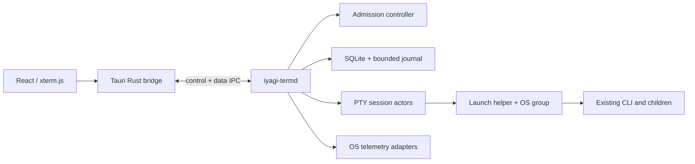

# IYAGI

**Your Interface to AGI**

> **IYAGI Terminal** — Talk to AI. Build with AGI.

[How AI missions work](docs/orchestration/USER_GUIDE.md) · [AI mission details](docs/orchestration/USER_GUIDE_DETAILS.md)

English | **[한국어](README_KR.md)**



## The name

IYAGI reads as *iyagi* — 이야기, the Korean word for "story" — with **AGI** hiding in plain sight:

```text
IY AGI
   ───
```

The name is the thesis. You don't merely issue commands to AI — you talk with it. And it
doesn't merely answer — it thinks and executes alongside you. Nor do you ever handle AGI
bare-handed: you work with it through an interface. Through IYAGI.

## The brand

One name, one job — a workable interface between people and AGI. IYAGI Terminal is the first
product of that family:

```text
IYAGI
Your Interface to AGI

IYAGI Terminal     → AI Coding / Agentic Engineering   (this repository)
IYAGI Workspace    → Knowledge / Work
IYAGI Agent        → Autonomous Tasks
IYAGI Studio       → Build & Orchestrate Agents
```

## IYAGI Terminal

IYAGI Terminal is a desktop terminal platform that runs the AI coding CLIs you already use —
Codex, Claude Code, OpenCode — exactly as they are, and governs the resources they consume.
It is built on Tauri 2 + React + xterm.js with a user-privileged Rust execution-manager
daemon (`iyagi-termd`). Model selection, LLM calls and conversation management stay with each
CLI; IYAGI owns execution, process groups and resource governance.

<p align="center">
  <a href="docs/media/iyagi-term-intro.mp4">
    
  </a>
  <br>
  <sub>30-second intro · <a href="docs/media/iyagi-term-intro.mp4">MP4, 1080p</a></sub>
</p>

## Download

**Latest: 0.1.1** (2026-10-10) — CPU hogs yield instead of freezing, the kernel's memory-pressure
signal replaces the fixed 10 % rule, and memory-suspended terminals resume on their own once the
host recovers. See the [release notes](RELEASE.md).

<p align="center">
  <a href="https://raw.githubusercontent.com/sh2orc/iyagi-term/main/releases/IYAGI.Term_0.1.1_aarch64.dmg">
    
  </a>
</p>

| Platform | File | Size | SHA-256 |
|---|---|---|---|
| macOS · Apple Silicon | [`IYAGI.Term_0.1.1_aarch64.dmg`](https://raw.githubusercontent.com/sh2orc/iyagi-term/main/releases/IYAGI.Term_0.1.1_aarch64.dmg) | 17 MB | `aed7aab63a89d203f215edb01a44bf6321494807453a7daea531534647535186` |

<details>
<summary>Signing & trust on macOS</summary>

The build is signed with a Developer ID and notarized (ticket stapled to the DMG), so it opens
without Gatekeeper warnings — `spctl` reports `source=Notarized Developer ID`.

The published SHA-256 travels in the same repository as the DMG, so it detects transport
corruption, not a compromise of the repository itself — see [releases/README.md](releases/README.md)
for the release integrity roadmap.
</details>

<details>
<summary>Other platforms & building from source</summary>

CI ([.github/workflows/ci.yml](.github/workflows/ci.yml)) builds a Linux `.deb` and
Windows/macOS release binaries (no installers; Windows/macOS on protected refs only).

From source: `npm ci && npm run tauri build`.
</details>

## Quick start

1. Open the DMG and drag **IYAGI Term** into Applications.
2. Run `claude`, `codex` or `opencode` in any pane as you always do — IYAGI detects them by
   process and shows the agent, model and working/waiting state in the pane header. An empty tab
   also offers one-click managed runs of the AI CLIs found on the machine.
3. Split with `Cmd+D` / `Cmd+Shift+D`, open the command palette with `Cmd+Shift+P`, and the
   managed-run queue with `Cmd+B`.
4. Close the window — terminals keep running in the daemon. Reopen the app to reattach with
   history replay.

## Why IYAGI

Running several AI coding agents on one dev machine easily saturates CPU and memory. IYAGI
doesn't wrap another chat UI around that problem — it goes below the conversation, to the OS,
where the work actually runs:

- Checks telemetry freshness, host pressure, concurrency, CPU slots and memory headroom
  **before** a new managed job starts (admission control with a priority queue that ages).
- Groups each managed job **with its descendants** at the OS level and stops the whole tree at
  once — Windows Job Objects, Linux cgroup v2 when a delegated subtree is available, an
  independent guardian process plus observed process tree on macOS. CPU/memory/process caps
  are enforced only where the OS supports them.
- **Pressure relief** shares CPU instead of freezing it: background agents under CPU pressure,
  and any terminal that stays over its CPU limit, drop to a lower scheduling tier (never
  stopped) and come back when the pressure or overage ends — with per-pane protected/yielded
  badges and resume-all.
- **Resource guard** handles memory: while host memory is under pressure, the daemon suspends a
  terminal whose process tree stays over its memory limit (SIGSTOP / cgroup freeze where
  available), and at critical pressure — under 1 GiB available, or when the kernel itself
  reports a crisis — the largest unfocused hog first. Once memory recovers they resume on their
  own, one at a time. The session you are looking at, and terminals you protect, are never
  frozen automatically.
- Attributes resource usage per job's process tree.
- Keeps terminal sessions alive when the window closes or the app quits: the daemon owns the
  PTYs, and reopening the app reattaches with history replay (IndexedDB screen snapshot +
  journal tail, so restarts don't re-render the whole session).
- Reports unknown measurements as unknown with a reason — never fakes a `0`.

## Features

**Terminal workbench**

- Tabs and nested split panes, up to 8 per tab (macOS `Cmd+D` / `Cmd+Shift+D`; Windows/Linux
  `Ctrl+Shift+D` / `Ctrl+Shift+E`), with drag or arrow-key dividers (double-click evens them out)
- Shell picker with detected shells and a default shell; an empty tab offers one-click managed runs
  of the AI CLIs found on the machine
- Per-pane zoom (`Cmd/Ctrl` `=` `-` `0`) with a paint gate that hides partial redraws during
  resize, input broadcast to every pane in the visible tab (`Cmd+Shift+B` / `Ctrl+Shift+B`), and
  search over the scrollback or the whole session journal (`Cmd+F` / `Ctrl+Shift+F`)
- Command palette (`Cmd/Ctrl+Shift+P`) and rebindable shortcuts (Settings › Keyboard shortcuts)
- macOS menu bar with every app feature: new terminal or tab (or a chosen shell), default shell, AI
  mission, managed run, agent sessions, close, terminal copy/paste/select all, find, clear, copy path or
  resume command, palette, layout editor, queue/graph/notification panels, font size, language, split,
  broadcast, move or restart panes, tab moves, merge and regroup, shortcuts and diagnostics — with live
  check marks, disabled states and your shortcut overrides
- Terminal right-click menu: open or copy a link, copy/paste/select all, find, clear, font size,
  split, broadcast, move to another tab, copy the path or the agent resume command, restart and
  close — with shortcut hints. It also opens over TUIs that capture the mouse (Claude Code,
  OpenCode); `Shift`+right-click sends the click to the app instead
- Tab regrouping: drag a pane header onto another pane's edge (place beside), its center (swap),
  a tab (move there) or between tabs (new tab); drag tabs to reorder, hold over a tab to merge. The
  same moves live in the tab, pane-header and right-click menus and the palette. The layout editor
  (Cmd+Shift+G) shows every group as a card with a mini-map of its splits plus the running terminals:
  drag blocks between groups, create or delete groups (terminals keep running), drag detached
  terminals back in, or regroup everything by Git repository after a preview
- Trackpad two-finger swipe to cycle tabs (configurable), slide+fade tab switching
- Safe clipboard and links: pastes over 1 MiB are refused and control sequences stripped,
  bracketed paste is used only when the program enables it, program clipboard writes (OSC 52) are
  off by default, and only http(s) links (plain URLs and OSC 8) open, through the OS opener
- Images and files arrive as paths: paste a screenshot, or drop files onto a pane, and the terminal
  receives the path so an AI CLI can read it. A clipboard image is written to a temporary file that
  is cleaned up a day later
- Pane headers follow the program-set title and working directory (OSC 0/2/7) and show the Git
  branch, CPU/RAM and replay or flow-control state; WebGL rendering (patched vendored addon, 12
  concurrent context cap, retry on context loss) with a DOM fallback; Unicode 11 widths for jamo
  and emoji
- Workspace restore: tabs, splits and live sessions come back on relaunch with history replay;
  closing panes or quitting asks whether to keep the terminals running (tray icon with
  Open / Quit keeps them alive in the background)

**AI agent awareness**

- Detects Claude Code, Codex and OpenCode in any pane — by process observation, not output
  scanning — and shows the agent, session, model and effort in the pane header, with
  working/waiting markers on the pane, tab and window title, per-agent icons and background tints
- Exited Claude Code, Codex and OpenCode sessions offer Resume in place, and the recent agent
  sessions dialog lets you jump to, resume or forget a session. **Attach terminal** in the
  recently finished list resumes Claude/Codex/OpenCode by their saved session ID, or replays
  retained output for an ordinary terminal. On relaunch, restored panes whose agent
  conversation had ended resume it in place — at most three at a time, holding back while host
  memory is critical — without holding up the rest of the restore
- Notification center for agent permission requests, questions and finished responses (through
  Claude/Codex hooks and an injected OpenCode session plugin — no global CLI config edits) and for
  finished managed runs, with desktop notifications while hidden
- Subscription usage gauges for Codex, Claude and Z.ai in the status bar
- Optional routing of Claude Code terminals (quickstart, Claude profiles, `ccd`/`ccg` shell
  functions, resume, one-shot `claude-exec`) through Z.ai (GLM) with one switch under Settings ›
  Integrations › Z.ai Coding Plan; the daemon resolves the encrypted local key
  (`term-secrets`, AES-256-GCM), which never enters a launch request
  (guide: [docs/orchestration/USER_GUIDE.md](docs/orchestration/USER_GUIDE.md#claude-code-terminals--zai-glm))

**Korean input (IME)**

- A dedicated IME bridge for macOS WKWebView × xterm 6 delivers Korean 2-set input to the PTY
  exactly as typed — single-ownership of insert events, a Hangul automaton for composition,
  and holds across the IME activation race at startup and after 한/영 switches
  (contract: [docs/implementation/07-korean-ime.md](docs/implementation/07-korean-ime.md))
- `Shift+Space` switches 한/영 on macOS (Auto / Always / Off), and a balloon shows CapsLock 한/영
  switches
- Bundled Korean coding font (Nanum Gothic Coding; D2Coding is used when installed) and UTF-8 PTY
  locale defaults

**Managed execution**

- Launch profiles (auto-discovery, compatibility matrix, JSON import/export) run user-registered
  executables and arguments as-is
- Managed-run composer (Settings › Managed run) with priority, memory reservation and an autonomy
  toggle — autonomy is on by default for Claude Code and Codex and adds their permission-skipping
  flags
- Queue drawer (`Cmd+B` / `Ctrl+B`) with wait reasons, cancel, attach and terminate; workload
  names follow the attached terminal's title
- Idempotent starts: replaying the same request ID never launches the CLI twice (request
  fingerprints, input dedup ring)
- One daemon and one app instance per user/data directory (launching again brings the running
  window forward) with a single writer per terminal; terminals outlive the window and the app,
  but not a daemon restart (running jobs are then marked interrupted)

**Resource governance & monitoring**

- Admission checks in a fixed order — telemetry freshness, host pressure, 2 concurrent managed
  jobs, CPU slots, reservation budget, memory headroom — with a 64-job queue that ages priorities
- Memory pressure from the kernel's own verdict (macOS memory-status level, Linux PSI) plus a
  1 GiB available floor; CPU pressure at 85 % / 95 % used. Thresholds ship inside the daemon
  binary ([defaults.json](docs/implementation/defaults.json))
- Resource strip (CPU, RAM and pressure, disk, network, the AI agents detected in your terminals
  per kind with how many are working or waiting for you, and managed running/queued with the
  wait reason when there are any) plus 5-minute graphs (300 samples) with per-metric source and
  quality labels
- Bounded output queues with flow control (per-view credits; a slow consumer blocks only its own
  view), rolling session journals (128 MiB per session, 2 GiB in total, 7-day retention) and
  capped history

**AI missions (preview, development builds only)**

- Hand a goal to an AI team — Lead conversation, task list, run details, decisions and result
  acceptance — on a daemon engine with plan validation, DAG scheduling, isolated Git worktree
  workspaces with writer leases, outbox recovery, time/cost/start budget gates, and Codex / Claude
  Code / OpenCode adapters (plus a deterministic fixture runtime for tests)
- Quick setup detects installed runtimes and models, builds a four-role team in one click;
  follow-up missions adopt a previous accepted result as their base
- Per-run detail with activity logs, exec (real terminal attach), changes and verification;
  file-change approvals show paths and diffs before you answer; rate-limit and cost waits,
  failure recovery and unknown-outcome reconciliation flow into a single decisions panel
- Result review with a verification checklist, import commands and workspace cleanup
- The mission protocol is off in release builds (see Status & Roadmap); verified end-to-end with
  a real Codex subscription mission on macOS
  ([evidence](docs/orchestration/CODEX_MACOS_MISSION_01540.md), [how it works](docs/orchestration/USER_GUIDE.md))

**Settings & appearance**

- Settings page with search and instant save: General, Terminal (font, cursor, scrollback, OSC 52,
  renderer, default shell, close/quit behavior), Integrations (usage, hooks, Z.ai key and GLM routing), Managed
  run, Launch profiles, Keyboard shortcuts and Compatibility
- System / Dark / Light themes that follow the OS live; Korean/English UI (top-bar toggle or
  automatic) with a dependency-free i18n core

## Architecture



```text
src/                  React app (tabs, split terminals, missions, monitor, queue, settings, profiles)
src-tauri/            Tauri shell (window, tray, detached daemon spawn, IPC bridge)
crates/
  term-contracts/     Cross-layer types, validation, TS generation (dependency hub)
  term-core/          State machines, admission, queueing, idempotency, mission planning (pure logic)
  term-platform/      OS resource groups (Linux cgroup / Windows Job / macOS guardian + observability), telemetry
  term-pty/           PTY session actors, MTJ1 journal, output flow control, launch gates
  term-storage/       SQLite metadata, migrations, fingerprints, crash recovery
  term-secrets/       App-local encrypted secret store (AES-256-GCM owner-only files)
  iyagi-termd/        Execution manager daemon + launch helper, agent watch, mission service and adapters
  term-fixture/       Deterministic load and protocol fixtures for verification (not in the product bundle)
  iyagi-bench/        Benchmark harness over the real daemon (latency, idle, flood, queue, replay)
```

Dependency direction is `UI → bridge → contracts → core`. `term-core` consumes
platform/pty/storage through traits and never references Tauri or React. Resource-admission
truth lives in exactly one place — the daemon.

**Tech stack:** React 18 · TypeScript 5.9 · xterm.js 6 · Zustand 4 · Vite 5 · Vitest 2 ·
Playwright · Tauri 2.11 · Rust 2021 (tokio, portable-pty, rusqlite, sysinfo, ts-rs).

## Requirements

- Rust ≥ 1.89 (MSRV), Node 22 LTS, Python 3 (spec verification scripts)
- Targets: macOS arm64/x86_64, Windows x86_64, Linux x86_64
- npm and Cargo lockfiles are committed; CI uses `npm ci` and `cargo --locked`

## Development

```sh
npm ci
npm run typecheck && npm run test:unit       # TS + vitest unit tests
npm run test:mission-ui                      # Playwright mission UI tests against a mock daemon
cargo fmt --all --check
cargo clippy --workspace --all-targets --locked -- -D warnings
cargo test --workspace --locked
python3 scripts/smoke_e2e.py                 # E2E smoke against the real daemon binary
python3 docs/orchestration/verify_spec.py    # mission spec asset/link checks
npm run tauri build                          # bundle the app
```

To run the app locally: `npm run tauri dev` (stages a debug `iyagi-termd` via
`beforeDevCommand`, then launches the Vite dev server and the Tauri window).

On macOS, `npm run tauri dev|build` signs local builds with a stable code-signing identity when
your keychain has one named `iyagi-dev` (`scripts/tauri.mjs`; set `IYAGI_SIGNING_IDENTITY` to use
another, `-` to keep ad-hoc). Ad-hoc signatures change on every build, so macOS privacy grants
such as "would like to access data from other apps" are asked again after each rebuild; a stable
identity keeps them. Create one in Keychain Access → Certificate Assistant → Create a
Certificate… (Identity Type: Self Signed Root, Certificate Type: Code Signing). macOS hosts without
that identity (such as CI) ad-hoc sign the whole bundle instead.

On hosts with an incomplete MSVC setup (Git Bash), run `source scripts/dev-env.sh` before
cargo (GNU toolchain + w64devkit).

**Linux verification image.** Tests that depend on Linux behavior — PTY actors, cgroup paths,
process groups, gate helpers — should run on real Linux. From a macOS host, use the Docker
image instead of cross-compiling:

```sh
docker build --platform linux/arm64 -t iyagi-ubuntu:24.04 scripts/docker/ubuntu-24.04
docker run --rm --platform linux/arm64 \
  -v "$PWD":/work -v iyagi-termd-target:/work/target -v iyagi-termd-cargo:/cache/cargo-home \
  -e CARGO_TARGET_DIR=/work/target \
  iyagi-ubuntu:24.04 bash -lc 'cd /work && cargo test --workspace --locked'
```

The named volumes keep the build and cargo caches across runs; `--platform linux/arm64` is for
Apple Silicon (omit it on x86_64 hosts). The image pins Rust 1.89, the workspace MSRV.

## Documentation

| Document | Content |
|---|---|
| [docs/orchestration/USER_GUIDE.md](docs/orchestration/USER_GUIDE.md) (+ KR, details) | How AI missions work — setup, decisions, recovery |
| [ORCHESTRATION_SPEC.md](ORCHESTRATION_SPEC.md) + [docs/orchestration/](docs/orchestration/) | Mission engine spec, tickets, and [implementation status](docs/orchestration/IMPLEMENTATION_STATUS.md) with verification evidence |
| [docs/implementation/07-korean-ime.md](docs/implementation/07-korean-ime.md) | Korean IME bridge contract (macOS WKWebView × xterm) |
| [docs/implementation/resource-governance-plan.md](docs/implementation/resource-governance-plan.md) | Resource guard and pressure relief design, with the current thresholds (Korean) |
| [docs/security/](docs/security/) | Security audit records |
| [RELEASE.md](RELEASE.md) | Release notes for every version |
| [releases/README.md](releases/README.md) | Release binaries, signing/notarization and trust posture |

## Status & Roadmap

v0.1.1 — **Resource-governance release.** CPU contention is shared instead of frozen, the
kernel's memory-pressure signal decides crises, memory-suspended terminals resume on their own,
and agent conversations resume paced on relaunch ([release notes](RELEASE.md)).

v0.1.0 — **R1 (local terminal + managed execution) shipped**: tab regrouping and the layout
editor, the terminal context menu, `Shift+Space` 한/영 toggle, resource guard and pressure
relief, agent session resume, Z.ai (GLM) routing, and the AI mission engine.

- **O1 — AI missions (mission/task/run): implemented behind a development-build gate.** The
  daemon engine (planning, DAG scheduling, workspaces, budgets, outbox recovery, message
  steering), storage, RPC, Codex / Claude Code / OpenCode adapters and the full mission UI are
  in place. A complete real-model mission (plan → two builders → integration → sandboxed
  verification → independent review → acceptance) has passed on macOS with a Codex subscription
  ([evidence](docs/orchestration/CODEX_MACOS_MISSION_01540.md)). Still open: enabling in release
  builds, compatibility evidence for other CLI/OS/authentication combinations, Windows native
  recovery, and remaining items tracked in
  [implementation status](docs/orchestration/IMPLEMENTATION_STATUS.md)
- **R2** — remote execution over SSH, terminal state checkpoints, per-CLI deep integration
- **R3** — task DAGs with explicit completion conditions, verified shared tool services

## License

Apache-2.0. See [LICENSE.md](LICENSE.md).
