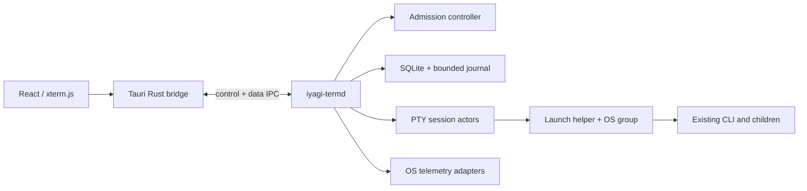

# IYAGI

**Your Interface to AGI**

> **IYAGI Terminal** — Talk to AI. Build with AGI.

[AI 작업 사용법](docs/orchestration/USER_GUIDE_KR.md) · [AI 작업 상세 안내](docs/orchestration/USER_GUIDE_DETAILS_KR.md)

한국어 | **[English](README.md)**


## 이름의 의미

IYAGI는 한국어 **이야기**로 읽히고, 그 안에 **AGI**가 숨어 있습니다.

```text
IY AGI
   ───
```

이름이 곧 제품의 논지입니다. 사람은 AI에게 명령만 내리는 존재가 아니라 AI와 **이야기**하고,
AI는 단순히 답하는 것이 아니라 함께 생각하고 실행합니다. 그리고 누구도 맨손으로 AGI를
다루지 않습니다 — IYAGI를 통해 AGI와 일합니다.

## 브랜드

하나의 이름, 하나의 역할 — 사람과 AGI 사이에 쓸 만한 인터페이스를 놓는 것. IYAGI Terminal은
그 첫 제품입니다.

```text
IYAGI
Your Interface to AGI

IYAGI Terminal     → AI 코딩 / 에이전트 엔지니어링   (이 저장소)
IYAGI Workspace    → 지식 / 실무 작업
IYAGI Agent        → 자율 작업
IYAGI Studio       → 에이전트 구축·오케스트레이션
```

## IYAGI Terminal

IYAGI Terminal은 기존 AI 코딩 CLI(Codex·Claude Code·OpenCode)를 그대로 실행하면서, 그 실행
자원을 관리하는 데스크톱 터미널 플랫폼입니다. Tauri 2 + React + xterm.js UI와 사용자 권한
Rust 실행 관리자 데몬(`iyagi-termd`)으로 구성됩니다. 모델 선택·LLM 호출·대화 관리는 각 CLI가
계속 담당하고, IYAGI가 실행·프로세스 그룹·자원 거버넌스를 소유합니다.

<p align="center">
  <a href="docs/media/iyagi-term-intro.mp4">
    
  </a>
  <br>
  <sub>30초 소개 영상(영어) · <a href="docs/media/iyagi-term-intro.mp4">MP4, 1080p</a></sub>
</p>

## 다운로드

<p align="center">
  <a href="https://raw.githubusercontent.com/sh2orc/iyagi-term/main/releases/IYAGI.Term_0.1.0_aarch64.dmg">
    
  </a>
</p>

| 플랫폼 | 파일 | 크기 | SHA-256 |
|---|---|---|---|
| macOS · Apple Silicon | [`IYAGI.Term_0.1.0_aarch64.dmg`](https://raw.githubusercontent.com/sh2orc/iyagi-term/main/releases/IYAGI.Term_0.1.0_aarch64.dmg) | 17 MB | `56e1a27e66bf1239f7775af96669f67759c493dcbc3965dd87a56240eac0407a` |

<details>
<summary>macOS 서명과 신뢰</summary>

빌드는 Developer ID로 서명하고 공증했으며(티켓을 DMG에 스테이플) Gatekeeper 경고 없이 열립니다 —
`spctl`은 `source=Notarized Developer ID`로 판정합니다.

게시된 SHA-256은 DMG와 같은 저장소에 있어 전송 중 손상은 감지하지만 저장소 자체가 침해된
경우는 검증하지 못합니다 — 릴리스 무결성 로드맵은 [releases/README.md](releases/README.md)를
참고하세요.
</details>

<details>
<summary>다른 플랫폼과 소스 빌드</summary>

CI([.github/workflows/ci.yml](.github/workflows/ci.yml))는 Linux `.deb`와 Windows/macOS 릴리스
바이너리(설치 파일 없음, 보호 브랜치에서만)를 만듭니다.

소스에서 직접 빌드: `npm ci && npm run tauri build`.
</details>

## 왜 IYAGI인가

개발 PC 하나에 AI 코딩 에이전트 여러 개를 돌리면 CPU와 메모리가 금방 포화됩니다. IYAGI는
또 하나의 채팅 UI를 포장하는 대신, 대화 아래 — 실제 작업이 도는 OS 수준 — 에서 문제를 다룹니다.

- 새 관리 작업을 시작하기 **전에** 텔레메트리 신선도·호스트 압력·동시 실행 수·CPU 슬롯·메모리
  여유를 확인합니다(기다릴수록 우선순위가 오르는 대기열이 있는 admission 제어).
- 관리 작업을 **자손까지** OS 수준에서 묶고 트리 전체를 한 번에 중단합니다 — Windows Job Object,
  위임된 서브트리가 있을 때의 Linux cgroup v2, macOS는 독립 guardian 프로세스와 프로세스 트리
  관측. CPU·메모리·프로세스 수 상한은 OS가 지원하는 곳에서만 강제합니다.
- **자원 가드**: 특정 터미널의 CPU·메모리 사용이 한도를 계속 넘으면 데몬이 그 프로세스 트리를
  일시 정지(SIGSTOP / 가능하면 cgroup freeze)하고 원클릭 재개를 제안합니다. 시스템 메모리가
  치명적으로 부족하면 포커스 없는 최대 소비자부터 먼저 정지합니다. 보고 있는 세션은 절대
  자동으로 정지하지 않습니다.
- **압력 완화(relief)**는 백그라운드 에이전트를 낮은 스케줄링 등급으로 내릴 뿐 종료하지 않으며,
  pane별 보호/양보 표시와 전체 재개를 제공합니다. 항상 되돌릴 수 있습니다.
- 작업별 프로세스 트리 단위로 자원 사용을 표시합니다.
- 창을 닫거나 앱을 종료해도 터미널이 삽니다. PTY는 앱이 아니라 데몬이 소유하고, 앱을 다시 열면
  기록을 재생하며 다시 붙습니다(IndexedDB 화면 스냅샷 + 저널 꼬리 재생으로 재시작 때 전체
  저널을 다시 그리지 않습니다).
- 모르는 측정값은 사유와 함께 '측정 불가'로 표시합니다. `0`으로 위조하지 않습니다.

## 기능

**터미널 워크벤치**

- 탭과 중첩 분할(탭당 최대 8개, macOS `Cmd+D` / `Cmd+Shift+D`, Windows/Linux `Ctrl+Shift+D` /
  `Ctrl+Shift+E`), 끌거나 방향키로 조절하는 분할선(더블클릭하면 균등 분할)
- 감지된 셸과 기본 셸을 고르는 셸 선택기, 빈 탭에서 이 PC에 설치된 AI CLI를 한 번에 관리 실행
- pane별 확대/축소(`Cmd/Ctrl` `=` `-` `0`, 리사이즈 중 불완전한 다시 그리기를 숨기는 페인트 게이트),
  보이는 탭의 모든 pane 동시 입력(`Cmd+Shift+B` / `Ctrl+Shift+B`), scrollback 또는 세션 저널 전체
  검색(`Cmd+F` / `Ctrl+Shift+F`)
- 커맨드 팔레트(`Cmd/Ctrl+Shift+P`)와 다시 지정할 수 있는 단축키(설정 › 단축키)
- macOS 메뉴 막대에 앱 기능 전체: 새 터미널·탭(셸 골라 열기 포함), 기본 셸, 새 AI 작업, 관리 실행,
  에이전트 세션, 닫기, 터미널 복사·붙여넣기·모두 선택, 찾기·화면 지우기, 경로·재개 명령 복사, 팔레트,
  배치 편집, 대기열·그래프·알림 패널, 글꼴 크기, 언어, 분할·동시 입력, pane 이동·다시 시작, 탭 이동·
  합치기·다시 묶기, 단축키·진단. 체크 표시·비활성 상태와 사용자 단축키 재정의가 그대로 반영됩니다
- 터미널 우클릭 메뉴: 링크 열기·복사, 복사·붙여넣기·모두 선택, 찾기, 화면 지우기, 글꼴 크기, 분할,
  동시 입력, 다른 탭으로 이동, 경로·에이전트 재개 명령 복사, 다시 시작·닫기(단축키 표시 포함).
  마우스를 잡는 TUI(Claude Code·OpenCode) 위에서도 열리고, `Shift`+우클릭은 클릭을 앱으로 보냅니다
- 탭 재그룹핑: pane 헤더를 끌어 다른 pane 가장자리(옆에 놓기)·가운데(자리 바꾸기)·탭 위(그 탭으로)·
  탭 사이(새 탭)에 놓고, 탭을 끌어 순서를 바꾸거나 탭 위에 머물러 합치기. 같은 동작을 탭·pane 헤더·
  우클릭 메뉴와 팔레트로도 한다. 배치 편집 화면(Cmd+Shift+G)은 그룹마다 분할 미니맵 카드와 실행 중인
  터미널 목록을 보여 주어, 블록을 그룹 사이로 옮기고, 그룹을 만들거나 지우고(터미널은 계속 실행),
  떨어져 나간 터미널을 다시 끌어 넣거나, 미리보기 후 Git 저장소별로 한 번에 다시 묶을 수 있다
- 트랙패드 두 손가락 스와이프로 탭 전환(설정 가능), 슬라이드+페이드 탭 전환 효과
- 안전한 클립보드·링크: 1 MiB 넘는 붙여넣기는 거절하고 제어 시퀀스를 걸러 내며, 괄호 붙여넣기는
  프로그램이 켰을 때만 쓰고, 프로그램의 클립보드 쓰기(OSC 52)는 기본으로 막고, 링크는 http(s)(일반
  URL과 OSC 8)만 OS 기본 앱으로 엽니다
- 이미지·파일은 경로로 들어갑니다: 스크린샷을 붙여넣거나 pane에 파일을 떨어뜨리면 그 경로가
  터미널에 입력되어 AI CLI가 바로 읽습니다. 클립보드 그림은 임시 파일로 저장하고 하루 뒤 치웁니다
- pane 헤더가 프로그램이 정한 제목·작업 디렉터리(OSC 0/2/7)를 따르고 Git 브랜치·CPU/RAM·재생/흐름
  제어 상태를 보여 줍니다. WebGL 렌더러(패치된 번들 애드온, 동시 컨텍스트 12개 상한, 컨텍스트
  손실 재시도)와 DOM 폴백, 한글·이모지 폭의 Unicode 11 적용
- 작업 공간 복원: 다시 실행하면 탭·분할·살아 있는 세션이 기록 재생과 함께 돌아오고, pane을 닫거나
  앱을 종료할 때 터미널을 계속 실행할지 묻습니다(트레이 아이콘의 열기/종료로 백그라운드 유지)

**AI 에이전트 인식**

- 어느 pane에서든 Claude Code·Codex·OpenCode를 프로세스 관측 기반으로 감지해(출력 스캔 아님)
  pane 헤더에 에이전트·세션·모델·effort를 표시하고, pane·탭·창 제목에 작업 중/응답 대기 표시와
  에이전트별 아이콘·배경 색을 붙입니다
- 끝난 Claude Code·Codex·OpenCode 세션은 그 자리에서 '이어서 열기'를 제공하고, 최근 에이전트 세션
  대화상자에서 이동·재개·기록 삭제를 합니다. 최근 종료된 터미널의 **터미널 연결**은
  Claude·Codex·OpenCode를 원래 세션 ID로 재개하고, 일반 터미널은 보관된 이전 출력을 복원합니다.
  앱 시작만으로 에이전트를 다시 실행하지 않습니다
- 에이전트의 권한 요청·질문·응답 완료(Claude/Codex hooks와 주입형 OpenCode 세션 플러그인 — CLI
  전역 설정은 건드리지 않음)와 관리 실행 종료를 모으는 알림 센터, 창이 숨어 있을 때는 데스크톱 알림
- 상태 표시줄의 Codex·Claude·Z.ai 구독 사용량 게이지
- 설정 › 연동 › Z.ai Coding Plan의 스위치 하나로 Claude Code 터미널(quickstart·Claude 프로필·
  `ccd`/`ccg` 셸 함수·재개·일회성 `claude-exec`)을 Z.ai(GLM)로 라우팅. 키는 로컬 암호화 저장소
  (`term-secrets`, AES-256-GCM)에 두고 데몬이 해석하며 실행 요청에는 들어가지 않습니다
  (안내: [docs/orchestration/USER_GUIDE_KR.md](docs/orchestration/USER_GUIDE_KR.md#claude-code-터미널--zaiglm))

**한글 입력(IME)**

- macOS WKWebView × xterm 6 환경에서 한글(두벌식) 입력이 사용자가 친 그대로 PTY에
  도달하도록 하는 전용 IME 브리지 — insert 이벤트 단일 소유, 조합용 한글 오토마타,
  시작·한/영 전환 직후 IME 활성화 경주 대응 홀드
  (계약: [docs/implementation/07-korean-ime.md](docs/implementation/07-korean-ime.md))
- macOS에서 `Shift+Space`로 한/영 전환(자동·항상·끄기), CapsLock 한/영 전환 시 풍선 표시
- 한글 코딩 폰트 번들(나눔고딕코딩, D2Coding이 설치돼 있으면 우선)과 PTY UTF-8 로케일 기본값

**관리 실행**

- 실행 프로필(자동 발견, 호환 매트릭스, JSON 가져오기/내보내기)이 사용자가 등록한 실행 파일과
  인수를 그대로 실행합니다
- 관리 실행 컴포저(설정 › 관리 실행): 우선순위, 메모리 예약, 자율 실행 토글 — 자율 실행은 Claude
  Code·Codex에 기본으로 켜져 있고 권한 확인을 건너뛰는 플래그를 붙입니다
- 대기열 drawer(`Cmd+B` / `Ctrl+B`): 대기 사유, 취소, 터미널 연결, 종료. 작업 이름은 붙은 터미널의
  제목을 따릅니다
- 멱등 시작: 같은 요청 ID를 재전송해도 CLI를 두 번 실행하지 않습니다(요청 지문, 입력 중복 제거 링)
- 사용자·데이터 디렉터리당 데몬 하나, 터미널마다 입력 소유자 하나. 터미널은 창·앱을 닫아도
  살지만 데몬이 재시작되면 끝납니다(실행 중이던 작업은 중단됨으로 표시)

**자원 거버넌스·모니터링**

- 정해진 순서의 admission 검사(텔레메트리 신선도, 호스트 압력, 관리 작업 동시 2개, CPU 슬롯, 예약
  예산, 메모리 여유)와 기다릴수록 우선순위가 오르는 64개 대기열
- 자원 스트립(CPU, RAM·압력, 디스크, 네트워크, 관리 작업 실행·대기 수와 대기 사유)과 5분(300 샘플)
  그래프, 지표별 출처·품질 라벨
- 흐름 제어가 있는 출력 큐(뷰별 크레딧, 느린 소비자는 자기 뷰만 차단), 순환하는 세션 저널(세션당
  128 MiB, 전체 2 GiB, 7일 보존), 크기 상한이 있는 히스토리

**AI 작업(미리보기, 개발 빌드 전용)**

- 목표를 AI 팀에 맡깁니다 — Lead 대화, 할 일 목록, 실행 상세, 결정, 결과 확정 — 계획 검증, DAG
  스케줄링, writer 임대가 있는 격리 Git worktree 작업 공간, outbox 복구, 시간·비용·시작 예산
  게이트를 갖춘 데몬 엔진과 Codex·Claude Code·OpenCode 어댑터(시험용 결정적 fixture 런타임 포함)
- 빠른 설정이 설치된 런타임과 모델을 감지해 한 번에 4역할 팀을 만들고, 후속 작업은 이전 확정
  결과를 base로 이어받습니다
- 실행 상세는 활동 로그·exec(실제 터미널 연결)·변경·검증 탭으로 구성되고, 파일 변경 승인은
  경로와 diff를 보여 준 뒤 답합니다. 제한 대기·비용 대기·실패 복구·불명 결과 조정이 하나의
  결정 패널로 모입니다
- 결과 화면은 검증 체크리스트, 가져오기 명령, 작업 공간 정리를 제공합니다
- AI 작업 프로토콜은 릴리스 빌드에서 꺼져 있습니다(상태 및 로드맵 참고). macOS Codex 구독으로
  실제 모델 전체 흐름이 종단 검증되었습니다
  ([증거](docs/orchestration/CODEX_MACOS_MISSION_01540.md), [사용법](docs/orchestration/USER_GUIDE_KR.md))

**설정·화면**

- 검색과 즉시 저장이 되는 설정 페이지: 일반, 터미널(글꼴·커서·scrollback·OSC 52·렌더러·기본 셸·
  닫기/종료 동작), 연동(사용량·hooks·Z.ai 키·GLM 라우팅), 관리 실행, 실행 프로필, 단축키, 호환성
- OS 설정을 바로 따르는 시스템·어둡게·밝게 테마, 외부 의존성 없는 i18n 코어의 한국어/영어 UI(상단
  바 전환 또는 자동)

## 아키텍처



```text
src/                  React 앱 (탭·분할 터미널·AI 작업·모니터·대기열·설정·프로필)
src-tauri/           Tauri 셸 (창·트레이, 데몬 분리 spawn, IPC 브리지)
crates/
  term-contracts/    계층 간 타입·검증·TS 생성 (의존 방향의 한가운데)
  term-core/         상태 머신·admission·대기열·멱등·AI 작업 계획 (순수 로직)
  term-platform/     OS 자원 그룹(Linux cgroup/Windows Job/macOS guardian+관측)·텔레메트리
  term-pty/          PTY 세션 액터·MTJ1 저널·출력 흐름 제어·실행 게이트
  term-storage/      SQLite 메타데이터·마이그레이션·지문·크래시 복구
  term-secrets/      앱 로컬 암호화 비밀 저장소 (AES-256-GCM 소유자 전용 파일)
  iyagi-termd/        실행 관리자 데몬 + launch helper·에이전트 감시·AI 작업 서비스와 어댑터
  term-fixture/      검증용 결정적 부하·프로토콜 fixture (제품 번들 제외)
  iyagi-bench/       실제 데몬 대상 벤치마크 하니스 (latency, idle, flood, queue, replay)
```

의존 방향은 `UI → bridge → contracts → core`입니다. `term-core`는 trait로 platform/pty/storage를
사용하며 Tauri나 React를 참조하지 않습니다. 자원 판정의 정답은 daemon 한 곳에만 있습니다.

**기술 스택:** React 18 · TypeScript 5.9 · xterm.js 6 · Zustand 4 · Vite 5 · Vitest 2 ·
Playwright · Tauri 2.11 · Rust 2021 (tokio, portable-pty, rusqlite, sysinfo, ts-rs).

## 요구 사항

- Rust 1.89 이상(MSRV), Node 22 LTS, Python 3(명세 검증 스크립트)
- 배포 대상: macOS arm64/x86_64, Windows x86_64, Linux x86_64
- npm과 Cargo lockfile을 커밋하고 CI에서는 `npm ci`, `cargo --locked`를 사용합니다

## 개발

```sh
npm ci
npm run typecheck && npm run test:unit       # TS + vitest 단위 시험
npm run test:mission-ui                      # Playwright AI 작업 UI 시험 (mock 데몬)
cargo fmt --all --check
cargo clippy --workspace --all-targets --locked -- -D warnings
cargo test --workspace --locked
python3 scripts/smoke_e2e.py                 # 실제 데몬 바이너리 E2E 스모크
python3 docs/orchestration/verify_spec.py    # AI 작업 명세 자산·링크 검사
npm run tauri build                          # 번들
```

로컬 실행은 `npm run tauri dev`입니다(`beforeDevCommand`가 디버그 `iyagi-termd`를 스테이징한 뒤
Vite 개발 서버와 Tauri 창을 띄웁니다).

macOS에서는 키체인에 `iyagi-dev`라는 코드 서명 인증서가 있으면 `npm run tauri dev|build`가 로컬
빌드를 그 인증서로 서명합니다(`scripts/tauri.mjs`; 다른 인증서는 `IYAGI_SIGNING_IDENTITY`로
지정하고 `-`면 ad-hoc을 유지). ad-hoc 서명은 빌드마다 바뀌어 "다른 앱의 데이터에 접근" 같은
macOS 개인정보 보호 허용을 다시 빌드할 때마다 또 묻지만, 고정 인증서로 서명하면 허용이
유지됩니다. 인증서는 키체인 접근 → 인증서 지원 → 인증서 생성…에서 만듭니다(신원 유형: 자체
서명 루트, 인증서 유형: 코드 서명). CI처럼 인증서가 없는 macOS 환경은 ad-hoc으로 번들 전체를 서명합니다.

MSVC가 불완전한 호스트(Git Bash)에서는 cargo 실행 전에 `source scripts/dev-env.sh`을
사용합니다(GNU 툴체인 + w64devkit).

**Linux 검증 이미지.** Linux 동작에 의존하는 시험 — PTY 액터, cgroup 경로, 프로세스 그룹,
게이트 헬퍼 — 은 실제 Linux에서 돌려야 합니다. macOS 호스트에서는 교차 컴파일 대신 Docker
이미지를 씁니다:

```sh
docker build --platform linux/arm64 -t iyagi-ubuntu:24.04 scripts/docker/ubuntu-24.04
docker run --rm --platform linux/arm64 \
  -v "$PWD":/work -v iyagi-termd-target:/work/target -v iyagi-termd-cargo:/cache/cargo-home \
  -e CARGO_TARGET_DIR=/work/target \
  iyagi-ubuntu:24.04 bash -lc 'cd /work && cargo test --workspace --locked'
```

네임드 볼륨으로 빌드·cargo 캐시를 실행 사이에 유지하고, `--platform linux/arm64`는 Apple
Silicon용입니다(x86_64 호스트에서는 생략). 이미지는 워크스페이스 MSRV인 Rust 1.89를
고정합니다.

## 문서

| 문서 | 내용 |
|---|---|
| [docs/orchestration/USER_GUIDE_KR.md](docs/orchestration/USER_GUIDE_KR.md) (+ EN, 상세) | AI 작업 사용법 — 설정, 결정, 복구 |
| [ORCHESTRATION_SPEC.md](ORCHESTRATION_SPEC.md) + [docs/orchestration/](docs/orchestration/) | AI 작업 엔진 명세·티켓, 검증 증거를 담은 [구현 상태](docs/orchestration/IMPLEMENTATION_STATUS.md) |
| [docs/implementation/07-korean-ime.md](docs/implementation/07-korean-ime.md) | 한글 IME 브리지 계약 (macOS WKWebView × xterm) |
| [docs/security/](docs/security/) | 보안 감사 기록 |
| [releases/README.md](releases/README.md) | 릴리스 바이너리와 신뢰 모델 |

## 상태 및 로드맵

v0.1.0 — **R1(로컬 터미널 + 관리 실행) 출시 완료.** 이후로 탭 재그룹핑과 배치 편집, 터미널
우클릭 메뉴, `Shift+Space` 한/영 전환, 자원 가드와 압력 완화, 에이전트 세션 재개, Z.ai(GLM)
라우팅, AI 작업 엔진이 더해졌습니다.

- **O1 — AI 작업(mission/task/run): 개발 빌드 전용 게이트 뒤에 구현 완료.** 데몬 엔진(계획, DAG
  스케줄링, 작업 공간, 예산, outbox 복구, 메시지 전달), 저장소, RPC, Codex/Claude Code/OpenCode
  어댑터와 AI 작업 UI 전부가 자리 잡았습니다. 실제 모델 전체 미션(계획 → Builder 두 개 → 통합 →
  샌드박스 검증 → 독립 리뷰 → 인수)이 macOS Codex 구독으로 통과했습니다
  ([증거](docs/orchestration/CODEX_MACOS_MISSION_01540.md)). 남은 일: 릴리스 빌드에서 켜기, 다른
  CLI/OS/인증 조합의 호환성 증거, Windows 네이티브 복구, 그 외
  [구현 상태](docs/orchestration/IMPLEMENTATION_STATUS.md)가 추적하는 항목들
- **R2** — SSH 원격 실행, 터미널 상태 체크포인트, CLI별 심화 연동
- **R3** — 명시적 완료 조건을 가진 작업 DAG, 검증된 공용 도구 서비스 재사용

## 라이선스

Apache-2.0. 전문은 [LICENSE.md](LICENSE.md)를 참고하세요.
