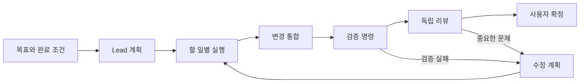

# AI 작업 상세 안내

짧은 사용법은 [AI 작업 사용법](USER_GUIDE_KR.md)에 있다. 이 문서는 인증 연결 절차, 복구·재조정, 메시지 전송 확인, 검증 격리, 자동 통합, 구현 위치 같은 운영·내부 세부를 모은다.
AI 작업은 개발 빌드의 기능이다. 릴리스 판정과 남은 제약은 [구현 상태](IMPLEMENTATION_STATUS.md)에 기록한다.

용어: **AI 작업**은 목표 하나를 맡긴 전체 작업(mission), **할 일**은 Lead가 나눈 단위(task), **실행**은 할 일의 한 번의 시도(run), **결과**는 합친 변경 커밋(candidate), **확정**은 결과를 최종으로 받아들이는 동작(accept)이다.

## 빠른 설정의 동작

**설정 → AI 작업 → 빠른 설정**은 설치된 Codex·Claude Code·OpenCode를 찾아 버전, 실행 파일 경로, 로그인 기록, 이 OS·버전에서 자동 실행이 검증됐는지를 카드로 보여 준다. 찾기는 아무것도 저장하지 않으며 인증 파일의 내용은 읽어 오지 않는다.

카드의 모델 칸은 그 CLI가 알려 준 후보를 목록으로 제시한다. Codex는 CLI에 직접 물어보고, Claude Code는 목록 기능이 없어 `--model`이 받는 별칭과 로컬 기록에서 관측된 모델 id를 쓴다. OpenCode는 빠른 설정으로 만들 수 없으므로 찾기 단계에서는 묻지 않는다(저장된 연결을 만든 뒤 **설치 확인**에서 받는다). 후보는 참고값이라 목록에 없는 id도 직접 입력할 수 있고, 목록을 못 받아도 찾기는 실패하지 않는다.

카드에서 모델을 확인하고 **이 모델로 팀 만들기**를 누르면 모델 연결 저장, 설치 확인, 네 역할(Lead·Builder·Reviewer·Integrator)에 같은 모델을 배정한 팀 템플릿 저장이 한 번에 진행된다. 같은 연결이나 팀이 이미 있으면 새로 만들지 않고 재사용한다. 설치 확인 후 어느 역할이라도 자동 실행이 검증되지 않으면 모델 연결만 저장하고 팀은 만들지 않으며 그 이유를 표시한다. 검증되지 않은 버전을 동의하에 쓰는 방법은 [실험적 연결](USER_GUIDE_KR.md#실험적-연결)을 참고한다.

OpenCode는 저장된 연결 참조가 필요해서 빠른 설정으로 만들 수 없다. 아래 **직접 설정하기**와 [OpenCode 인증 연결](#opencode-인증-연결)을 따른다.

## 진입점과 사용 가능 여부

상단 막대의 **새 AI 작업** 버튼(단축키 `Cmd/Ctrl+Shift+M`), 명령 팔레트, 메뉴 막대, 터미널 오른쪽 클릭 메뉴의 **이 폴더에서 AI 작업…**, 에이전트가 떠 있는 pane ⋯ 메뉴의 **이 저장소에서 AI 팀에 맡기기…**가 같은 대화상자를 연다. 초점 pane의 Git 최상위 경로(없으면 현재 폴더)가 저장소 경로로 채워진다. 에이전트 pane에서 열어도 현재 대화는 옮겨지지 않는다.

데몬이 capabilities의 `mission_protocol`을 선언하지 않으면 개발 빌드는 진입점을 비활성화하고 사유를 보이며, 프로덕션 빌드는 진입점을 숨긴다. 데몬의 프로토콜 revision이 앱보다 새로우면 빌드 종류와 관계없이 비활성화하고 앱 업데이트를 안내한다.

## 직접 설정하기

빠른 설정 대신 세부 값을 직접 지정하려면 **설정 → AI 작업**의 **직접 입력(고급)**을 연다.

1. 사용할 CLI를 설치한다. Codex와 Claude는 아래 구독 로그인 또는 저장된 인증 연결을 선택하고, OpenCode는 저장된 연결을 등록한다. 나머지 지원 범위는 [구현 상태](IMPLEMENTATION_STATUS.md)를 확인한다.
2. **설정 → AI 작업 → 모델 연결 → 직접 입력(고급)**에서 표시 이름, CLI 종류, 실행 파일의 전체 경로, 제공자 ID, 모델 ID, 인증 방식을 입력하고 **모델 저장**을 누른다. **모델 ID** 칸은 설치된 CLI가 실제로 알려 준 후보를 목록으로 제시한다. 후보는 참고값이므로 목록에 없는 id도 직접 입력할 수 있다. 고른 모델이 추론 강도를 알려 주면 **추론 강도** 칸이 함께 나타난다. 비워 두면 CLI 기본값을 쓴다. 비용을 예상할 수 있다면 **실행 1회 예상 비용(USD, 선택)**에 양수 금액을 입력한다. 비우면 미확인 비용으로 취급한다. 모델을 임의로 대체하지 않는다.
3. 모델을 저장한 뒤 **설치 확인**(버튼 문구 `지금 확인`)으로 실행 파일과 버전을 확인한다. 편집 중이면 먼저 저장한다. 확인 시각·버전과 실행 파일 지문을 저장하며 실패하면 예전 확인 결과를 사용하지 않는다. 파일 없음·실행 실패·3초 시간 초과·출력 한도 초과·버전 형식 오류를 구분해서 안내한다. 사용자가 정한 활성화 상태는 유지한다. 이 동작은 지정 파일을 검사하고 로컬 `--version`을 실행한 뒤, 모델 호출·인증 토큰 없이 이 PC에서 프로토콜·sandbox 자가 진단을 함께 수행한다(로그인·인증 권한·유료 추론은 확인하지 않는다). 확인에 성공하면 그 연결의 제공자에 맞는 모델 후보도 함께 받아 **모델 ID** 칸에 채운다. 이 목록은 고르기 편하라고 주는 참고값이며 호환 등급이나 역할 판정을 바꾸지 않는다. 목록을 못 받아도 확인 자체는 실패하지 않는다.
4. **팀 템플릿**에 이름을 입력하고 Lead, Builder, Reviewer, Integrator의 모델을 각각 선택해 저장한다. **모든 역할에 같은 모델**을 고르면 네 역할이 한 번에 채워진다. Integrator는 충돌 해결을 맡으며 기본값은 Builder와 같다. 저장된 팀에서 각 역할의 배정을 확인할 수 있다. 기존 세 역할 템플릿은 네 역할을 갖춘 템플릿으로 다시 저장한 뒤 새 AI 작업에 사용한다. 같은 모델을 여러 역할에 지정할 수 있으며 실행과 작업 디렉터리는 분리된다.
5. 자동 검증이 필요하면 **저장소별 검증 명령**에서 저장소를 확인한 뒤 명령을 저장한다. 프로그램과 인자를 구분해 입력한다. 인자는 공백으로 구분하거나(따옴표로 묶기 가능) JSON 배열로 입력한다. 예를 들어 프로그램 `npm`, 인자 `test -- --run` 또는 `["test", "--", "--run"]`이다. 실행 경로를 비우면 저장소 최상위에서 실행한다.

이전 개발 버전에서 저장한 설치 정보에 서버 확인 기록이나 파일 지문이 없으면 미확인으로 표시한다. 해당 모델 연결에서 **설치 확인**을 다시 실행한다. 설정 파일의 지원 여부를 직접 바꿔도 호환성이 검증된 것으로 취급하지 않는다.

팀의 각 모델은 구조화된 결과·진행 이벤트·취소와 역할에 필요한 읽기/쓰기 기능이 검증되어야 한다. 부족한 역할은 새 AI 작업 화면에 표시되고 **만들고 시작**이 비활성화된다. **현재 네 역할을 모두 배정할 수 있는 검증 조합은 Apple Silicon macOS의 Codex 0.154.0 + ChatGPT 구독 + `gpt-5.6-luna`다.** 제공자는 `openai`, 저장된 인증·엔드포인트 참조는 모두 비운다. 이 연결을 저장하고 **설치 확인**을 누른 뒤 네 역할에 선택한다. 파일 변경 승인을 요청하면 결정 패널에서 경로·변경 내용과 추가 권한을 확인하고 답한다. 변경 목록을 확인할 수 없으면 승인이 비활성화되므로 거절하거나 실행을 중단한다. 다른 버전·모델·인증 방식은 이 증거를 공유하지 않는다. 이 조합에서는 실제 모델의 계획·두 Builder·통합·검증·독립 리뷰·확정까지 통과했다. [전체 AI 작업 검증](CODEX_MACOS_MISSION_01540.md). 다른 조합과 릴리스 검증은 별도로 남아 있다. [실제 검증 범위](CODEX_MACOS_01540.md)

진행 중인 할 일이 **필요 기능 미검증으로 대기**에 들어가면 시도 횟수와 예산을 새로 사용하지 않는다. 설정에서 설치를 다시 확인하거나 할 일 상세의 **모델 변경**으로 호환되는 연결을 선택한다. 조건이 충족되면 실행 중인 AI 작업이 다시 예약한다. 예약 후 지정 파일의 내용·해결된 경로·CLI 버전이 달라졌거나 조회에 실패하면 모델에 요청을 보내기 전에 실패로 남긴다. 설치를 다시 확인한 뒤 직접 재시도하며, 이미 예약한 시도의 기록과 횟수는 유지한다.

같은 Git 저장소의 연결된 worktree·하위 폴더·symlink는 같은 저장소 ID와 저장소별 검증 명령을 사용한다. 실제 작업 경로와 기준 HEAD는 선택한 worktree에서 확인한다. 이전 개발 버전의 여러 저장소 ID가 같은 Git 저장소를 가리키면 자동 병합하지 않고 오류를 표시한다. 기존 AI 작업과 검증 명령의 참조는 보존한다.

## Codex 인증 연결

**ChatGPT 구독**은 공식 Codex CLI에서 먼저 로그인한 뒤 모델 연결의 CLI를 **Codex**, 제공자를 `openai`, 인증 방식을 **구독**으로 저장한다. 데몬과 CLI가 같은 `CODEX_HOME`을 사용해야 한다. 기본값은 사용자 홈의 `.codex`다. 로그인·토큰 갱신은 Codex가 관리하고, 데몬은 실제 계정이 ChatGPT 인증인지 확인한다. API 키 로그인만 있는 경우 구독 실행을 시작하지 않는다. [공식 인증 안내](https://learn.chatgpt.com/docs/auth)

**API 키**는 OS 비밀 저장소에 Codex 전용 연결을 등록한다. 개발 CLI 빌드·데이터 디렉터리·stdin 사용법은 아래 OpenCode 절과 같다.

```sh
pbpaste | ./target/debug/iyagi-termd connection add --preset codex-api --key-stdin
```

반환된 두 참조를 **모델 연결 → Codex → API 키 → 저장된 인증 참조 / 저장된 엔드포인트 ID**에 입력한다. 제공자는 `openai`, 고정 목적지는 `https://api.openai.com/v1`이다. OpenCode용 `openai-api` 참조를 재사용할 수 없다. 회전·해제 방법은 OpenCode 절의 공통 연결 명령을 사용한다.

API 실행은 별도 HOME·CODEX_HOME과 메모리 인증 저장소를 사용한다. 데몬은 실제 설정과 인증 목적지를 확인한 뒤 공식 `account/login/start`로 키를 전달한다. 키는 프로세스 인자·환경 변수·launch manifest에 넣지 않는다. 계정 인증 방식이나 thread의 제공자가 다르면 중단한다. `auth.json`을 만들지 않으며 프로세스 종료와 종료 기록 저장을 확인한 후 임시 디렉터리를 제거한다. 구독 실행은 Codex가 관리하는 기존 홈을 사용하므로 같은 격리 범위를 주장하지 않는다. [App Server 인증](https://learn.chatgpt.com/docs/app-server), [메모리 인증 저장 설정](https://learn.chatgpt.com/docs/config-file/config-reference)

Codex 0.154.0의 API 인증은 설정·인증 조회까지 시험했다. 구독 인증은 위 Apple Silicon macOS 조합에서 실제 구조화 응답·파일 생성 승인·즉시 취소·프로세스 정리를 확인했다. 재개·실행 중 추가 지시·사용량의 macOS 지원은 아직 검증하지 않았다. 다른 버전은 필요한 응답과 설정을 확인할 수 없으면 실행을 거절한다. 사용자 지정 제공자·endpoint와 로컬 인증은 아직 지원하지 않는다.

## Claude 인증 연결

**기존 Claude 구독 로그인**을 사용하려면 공식 Claude CLI에서 로그인하고, 모델 연결의 CLI를 **Claude Code**, 제공자를 `anthropic`, 인증 방식을 **구독**으로 선택한다. **저장된 인증 참조와 엔드포인트 ID를 모두 비운다.** 데몬과 CLI는 같은 사용자 홈과 `CLAUDE_CONFIG_DIR`를 사용해야 한다. 기본 설정 경로는 `~/.claude`다. 실제 실행 프로세스의 초기화 응답에서 구독 계정임을 확인한 뒤 요청을 보낸다. Console API 로그인이나 확인할 수 없는 인증 방식은 거절한다. 로그인·갱신은 공식 CLI가 관리한다. [인증 안내](https://code.claude.com/docs/en/authentication)

**API 키·별도 구독 토큰·Z.ai Coding**은 다음 preset으로 OS 비밀 저장소에 등록한다. 개발 CLI 빌드와 데이터 디렉터리 지정은 아래 OpenCode 절을 참고한다.

| preset | 제공자 ID | 인증 방식 | 고정 목적지 |
| --- | --- | --- | --- |
| `claude-api` | `anthropic` | API 키 | `https://api.anthropic.com` |
| `claude-subscription` | `anthropic` | 구독 | `https://api.anthropic.com` |
| `claude-zai-coding` | `zai-coding-plan` | 구독 | `https://api.z.ai/api/anthropic` |

```sh
pbpaste | ./target/debug/iyagi-termd connection add --preset claude-api --key-stdin
```

반환된 `credential_ref`와 `endpoint_ref`를 Claude 모델 연결에 입력하고 표의 제공자·인증 방식을 선택한다. 구독 토큰은 사용자가 공식 `claude setup-token`에서 발급한 값을 `claude-subscription`으로 등록한다. 이 토큰은 데몬이 자동 갱신하지 않는다. 만료되면 새 토큰으로 새 연결을 등록하고 참조를 교체한다. 모델 ID는 정확히 지정하며, Z.ai의 모델·구독 지원은 [공식 연결 안내](https://docs.z.ai/devpack/tool/claude)에서 확인한다. OpenCode용 참조를 재사용할 수 없다. [토큰 환경 변수](https://code.claude.com/docs/en/env-vars) **설정 → 연동 → Z.ai Coding Plan**에 저장하는 키는 별도 저장소이며 대화형 Claude 터미널에만 쓴다. [Claude Code 터미널 → Z.ai(GLM)](USER_GUIDE_KR.md#claude-code-터미널--zaiglm)을 참고한다.

저장된 연결은 실행별 HOME·설정·임시 디렉터리를 사용한다. 키는 해당 자식 프로세스의 환경으로만 전달하고 인자·RPC·실행 manifest에는 기록하지 않는다. 인증 출처와 권한 모드를 확인한 후 프롬프트를 보내며, 종료 기록 저장까지 확인한 뒤 임시 디렉터리를 해제한다. 기존 구독 로그인은 사용자 홈을 공유한다.

현재 Claude 자동 실행은 읽기 할 일에 `Read/Glob/Grep`, 쓰기 할 일에는 추가로 `Edit/Write`를 허용한다. Bash·사용자 hook/plugin/MCP·대화형 승인은 이 경로에서 사용하지 않는다. 실행 세션을 저장하거나 재개하지 않으며, CLI의 제한 모드가 OS sandbox 검증을 대신하지 않는다. 설치된 Claude Code 2.1.271에서 세 저장 연결의 인증 초기화를 더미 키로 시험했다. 실제 구독 로그인·모델 호출 권한·유료 추론 호환성은 별도 검증이 필요하다. [CLI 옵션](https://code.claude.com/docs/en/cli-reference)

## OpenCode 인증 연결

OpenCode 자동 실행은 사용자의 전역 인증 설정을 읽지 않는다. 먼저 로컬 `iyagi-termd connection add`로 키를 OS 비밀 저장소에 등록한다. 개발 저장소에서는 `cargo build -p iyagi-termd`로 만든 `./target/debug/iyagi-termd`를 사용할 수 있다. 앱이 별도 데이터 디렉터리를 사용한다면 명령에도 같은 `--data-dir`를 지정한다.

macOS에서 비밀 관리 도구로 복사한 키를 등록하는 예시다. 키는 인자나 셸 명령에 직접 적지 않고 stdin으로 전달한다.

```sh
pbpaste | ./target/debug/iyagi-termd connection add --preset zai-coding --key-stdin
./target/debug/iyagi-termd connection list
```

| preset | 제공자 ID | 인증 방식 | 고정 엔드포인트 |
| --- | --- | --- | --- |
| `zai-coding` | `zai-coding-plan` | 구독 | `https://api.z.ai/api/coding/paas/v4` |
| `zai-api` | `zai` | API 키 | `https://api.z.ai/api/paas/v4` |
| `openai-api` | `openai` | API 키 | `https://api.openai.com/v1` |
| `anthropic-api` | `anthropic` | API 키 | `https://api.anthropic.com/v1` |

출력 JSON의 `credential_ref`와 `endpoint_ref`를 **모델 연결 → OpenCode → 저장된 인증 참조 / 저장된 엔드포인트 ID**에 입력한다. 제공자와 인증 방식도 표에 맞춘다. 모델 ID는 정확한 API ID를 직접 지정한다. 키 자체는 설정 화면에 입력하지 않는다. 출력과 메타데이터 파일에는 키가 포함되지 않는다.

키를 바꿀 때는 새 연결을 만들고 모델 연결의 두 참조를 수정한다. 기존 연결의 키를 지우려면 `iyagi-termd connection revoke --endpoint UUID`를 사용한다. 실행 기록용 엔드포인트 메타데이터는 유지된다. 이미 시작한 프로세스에 전달된 키를 소급해서 지우지는 않으므로 해당 실행을 먼저 중단하고, 제공자의 키 폐기도 별도로 수행한다.

데몬은 시작 전 연결의 제공자·인증 방식·목적지를 대조하고 OpenCode가 읽은 실제 설정도 확인한다. 실행별 HOME/XDG/temp 디렉터리와 환경을 사용하고 정리 확인 후 디렉터리를 제거한다. 구독용·일반 API 목적지는 [Z.ai 공식 안내](https://docs.z.ai/devpack/tool/opencode)와 [API 안내](https://docs.z.ai/guides/overview/quick-start)에 따라 분리한다. 임의 endpoint, 로컬 모델, 다른 OAuth 연결의 자동 실행은 아직 연결하지 않았다. 설치 확인이나 설정 조회 성공만으로 유료 추론·구독 권한·OS 격리를 검증한 것으로 간주하지 않는다.

## AI 작업 시작하기

터미널 pane을 오른쪽 클릭해 **이 폴더에서 AI 작업…**을 고르거나 상단 막대의 **새 AI 작업**을 누른다. 초점 pane의 Git 최상위 경로(없으면 현재 폴더)가 저장소 경로로 채워지고 바로 **저장소 확인**이 실행된다. 경로를 직접 입력하거나 고친 경우에도 입력란을 벗어나면 자동으로 확인한다. 확인 결과는 저장소 최상위 경로, 현재 커밋, 변경 여부다. 최소 하나의 커밋이 필요하다. 커밋하지 않은 변경이 있으면 **커밋하지 않은 변경을 포함해서 시작**을 켠 채로(기본값) 시작할 수 있다. 이때 daemon은 그 작업 트리를 자기 영역의 비공개 스냅샷 커밋으로 기록해 기준으로 삼는다 — 사용자의 작업 디렉터리·index·branch·HEAD는 그대로이고 자동 커밋이나 stash는 하지 않는다. 추적되지 않는 파일도 포함하지만 `.gitignore` 대상은 제외한다. 체크를 끄면 현재 커밋(HEAD)이 기준이 되고 작업 트리가 깨끗해야 시작한다. merge·rebase가 진행 중이거나 커밋하지 않은 변경이 한도를 넘으면 포함을 거절하니 먼저 정리한다. 변경 경로는 최대 20개까지 나열하며 추적되지 않는 파일도 포함한다.

목표를 구체적으로 입력한다. 팀은 저장된 첫 템플릿이 자동으로 선택되고, 목록을 다시 읽어도 사용자가 고른 팀은 바뀌지 않는다. 저장된 팀이 없거나 선택한 팀에 검증되지 않은 역할이 있으면 대화상자 안에 빠른 설정 카드가 나타나며, 여기서 바로 팀을 만들 수 있다.

**완료 조건 (선택)**을 펼치면 조건을 직접 적고 조건별로 저장된 검증 명령을 선택할 수 있다. 사람이 최종 확인해야 하는 조건은 **사용자 확인**으로 표시한다. 완료 조건을 비워 두면 “목표 달성 확인: (목표 첫 줄)”이라는 사용자 확인 조건 하나가 만들어지고, 확정할 때 목표 달성 여부를 직접 확인한다. 이 OS에서 검증 명령을 실행할 수 없는 저장소라면 검증 선택을 막고 조건을 사용자 확인으로 바꿔 둔다.

**리뷰**는 접히지 않고 보인다. **리뷰 포함(권장)**은 Reviewer의 독립 리뷰를 거치고, **리뷰 생략(빠름)**은 Reviewer 역할 없이 검증 명령과 직접 확인만으로 확정한다. 팀에 Reviewer가 없으면 기본값이 리뷰 생략이다.

**실행 설정**은 기본으로 접혀 있고 요약(병렬 수·시도 횟수·시간 제한(분)·비용 상한)만 보인다. 펼쳐서 병렬 실행 수, 할 일당 최대 시도, 실행 시간 제한(분, 1–120), 비용 상한과 **비용을 확인할 수 없을 때**의 처리 방식을 바꿀 수 있다. 비용 입력 단위는 USD이며 소수점 아래 6자리까지 입력할 수 있다. 비용 상한을 비워도 미확인 비용 차단 정책은 적용된다. **계획 자동 적용**을 끄면 Lead의 계획을 직접 적용하거나 수정을 요청한다.

**만들고 시작**을 누르면 목표를 저장하고 AI 작업을 만든 다음 실행한다. 생성은 성공했지만 시작에 실패한 경우 주 버튼이 **다시 시작**으로 바뀌며 같은 AI 작업을 사용한다(새 AI 작업을 또 만들지 않는다). 시작이 저장소의 기준 커밋이나 저장소 등록 변경으로 거절되면 **현재 HEAD로 다시 만들기**(또는 **현재 저장소로 다시 만들기**)가 나타난다. 입력은 그대로 두고 기존 초안을 가능하면 취소한 뒤 저장소를 다시 확인해 새로 만든다. 시작하지 못한 초안을 둔 채 설정으로 이동하면 초안을 탭에 열어 두고(탭 상한이면 목록에 남기고) 위치를 알린다. 초안 탭 헤더의 **시작**과 **초안 삭제**(중단 후 보관, 직후 되돌리기 가능)로 이어서 처리한다.

후속 AI 작업은 완료된 AI 작업의 **이 결과로 후속 AI 작업 만들기**에서 연다. 이전 AI 작업이 확정 완료이고 같은 저장소면 확정 결과 커밋을 기준(`expected_base_oid`)으로 보내고 `follow_up_of`를 기록하며, 저장소 HEAD와 커밋하지 않은 변경 경고는 보이지 않는다. 다른 저장소이거나 확정되지 않았으면 현재 HEAD에서 시작한다고 알린다. 이전 결과 커밋이 바뀌면 `follow_up_base_mismatch`로 거절되므로 대화상자를 다시 연다.

## 실행 중 확인하기



**할 일 목록**에서 할 일별 모델, 실행 상태, 의존 관계, 시도 이력을 확인한다. 각 할 일의 에이전트는 데몬 소유의 별도 Git worktree(작업 공간)에서 일한다. 종료를 확인한 뒤 실제 변경을 수집하고 허용 경로를 검사한다. 에이전트의 “테스트 성공” 보고와 최종 결과에 대한 실제 검증 기록은 별개다.

**결정 필요**가 표시되면 해당 질문을 열고 답한다. 계획의 적용 답변은 할 일 생성과 함께 저장된다. 실행 승인은 해당 실행의 정확한 제공자 요청에 연결해 전달한다.

### 실패한 할 일 다시 시도

계획·할 일 실행이 실패하면 **결정 필요**에서 오류와 시도 한도를 확인한다. 인증·모델 설정이나 입력 문제를 해결한 뒤 **원인 해결 후 다시 시도**를 선택한다. 다른 모델이 필요하면 실패한 할 일의 상세에서 **모델 변경 후 재시도**를 사용한다. 정책에 허용된 활성 모델만 선택할 수 있으며, 모델 선택과 재시도 승인을 함께 저장한다. 재시도는 기존 할 일의 새 실행이므로 이전 실패 기록과 시도 횟수가 유지된다. 한도에 도달하면 한도를 조정하거나 **AI 작업 중단(실패로 기록)**을 선택한다. 종료는 다른 소유 실행이 정리된 뒤 확정된다. 실패한 할 일에 의존하는 할 일은 대기하고 관련 없는 할 일은 계속 진행한다. 재시도는 전달 여부가 불명확한 메시지를 다시 보내지 않는다.

에이전트가 스스로 진행할 수 없다고 보고하면(`provider_blocked`) 결정 패널에 AI 보고 본문과 보고 코드가 보인다. **지시 추가 후 다시 시도**, **모델 변경**, **대체 계획 요청**, **AI 작업 중단** 중에서 고른다.

### 할 일 실행 중단

**이 할 일 실행 중단**은 해당 실행만 취소한다(실행이 없으면 **할 일 취소**). 의존하는 할 일이 있으면 확인창에 그 수를 표시한다. 필수 할 일의 완료 조건은 유지되므로 종료 확인 후 상세의 **다시 시도** 또는 **모델 변경 후 재시도**를 선택하거나, Lead 대화에서 취소한 할 일과 의존 할 일을 대체할 계획을 요청한다. 취소한 검증·리뷰도 자동으로 다시 시작하지 않는다. 선택 할 일은 완료하거나 취소해야 다음 단계로 진행하며, 이미 다음 단계로 넘어간 할 일을 다시 수행하려면 새 계획이 필요하다. 대체 계획에도 원래 요구사항과 실행 한도가 적용되고 이전 기록은 보존된다. 취소한 필수 할 일은 확정을 막으며, 원래 실행을 성공으로 표시하거나 요구사항을 삭제하지 않는다.

실패한 Lead가 있으면 추가 메시지는 대기하며 자동으로 새 계획을 반복 생성하지 않는다. 먼저 해당 실행의 복구 결정을 처리한다. 일시정지 중에 재시도를 선택해도 새 실행은 **계속 실행** 후 시작한다. 종료 여부가 불명확한 실행은 재시도할 수 없다.

### 결과를 알 수 없는 실행 복구

연결이 끊겨 `unknown` 또는 `interrupted`로 남은 실행은 저장된 로컬 종료 증거를 확인한다. 실행 감독기가 소유 프로세스 그룹과 출력 처리를 정리한 뒤 저장한 `Exec.exited` 기록, 실행 연결, 원본 실행 명세의 해시를 검증한다. 확인되면 **결정 필요 → 이전 영향 확인 후 새 시도 시작**을 선택할 수 있다. 제공자 결과와 이미 수행한 외부 작업은 여전히 불명확하므로 먼저 이전 변경과 외부 영향을 확인한다. 다른 모델이 필요하면 상세의 **모델 변경**으로 허용된 연결을 선택한 뒤 새 시도를 결정한다.

새 시도는 새 실행과 작업 공간을 사용한다. 기존 실행 상태·결과·시도 이력과 격리된 작업 공간은 보존하며, 전달 불명 메시지를 재전송하지 않는다. 종료 증거가 없으면 모델 변경과 재시도를 계속 막는다. 메모리에서 실행을 찾지 못하거나 PID가 조회되지 않는 것만으로 종료를 확정하지 않는다.

Linux에서 실행 시작 전에 커널 그룹 식별자를 저장한 경우에는 재시작 후 같은 cgroup을 확인한다. 살아 있으면 계속 관찰하며, **AI 작업 중단** 또는 기존 실행의 취소 요청이 저장되면 해당 그룹을 중단한다. 그룹이 비었음을 확인하고 종료 기록을 저장해야 예약을 해제한다. 저장 실패 중에도 그룹 증거를 보존해 다시 복구할 수 있다.

macOS의 새 실행은 별도 감독 프로세스가 관찰 상태를 유지하므로 데몬 재시작 후에도 그 감독자에 다시 연결해 취소할 수 있다. 감독자와 시작한 실행의 신원이 일치해야 하며, 감독자 자체가 사라졌다는 이유로 종료를 확정하지 않는다. macOS는 관찰한 프로세스만 확인한다. 관찰에서 벗어난 자식이 남을 수 있어 상세와 재시도 결정에 이 범위를 표시한다.

식별자 없는 과거 기록, 독립 감독자 없는 관찰 트리, Windows의 재소유와 제공자 결과 재조회는 아직 지원하지 않는다. 미확인 제공자 비용도 로컬 종료만으로 확정하지 않는다.

재시작 후에도 종료 미확인 실행은 원래 메모리·CPU·동시 실행 한도에 포함된다. AI 작업을 보관하거나 종료해도 실제 실행의 종료 기록 없이는 예약을 지우지 않는다. 복구 기록을 읽거나 검증할 수 없으면 새 실행을 보류하고, 정상 조회가 가능해지면 다시 진행한다. 이 보류 중에도 현재 감독 중인 실행의 종료와 취소 처리는 계속한다.

### 멈춘 실행 직접 확인

종료 증거가 없어 실행 자리를 계속 차지하는 실행에는 할 일 상세에 한 줄 안내와 **프로세스 종료를 직접 확인했습니다**가 나타난다. 펼치면 기록된 PID·프로세스 그룹과 확인 방법(macOS·Linux는 `ps -p <PID> -o pid,lstart,command` 또는 활동 모니터, Windows는 작업 관리자의 세부 정보 탭)을 보여 준다. PID는 다른 프로세스에 다시 쓰일 수 있으므로 시작 시각과 명령도 함께 확인한다. 확인 체크 후 **직접 확인으로 정리**를 누르면 데몬에 사용자 확인(`mission.run.attest_exited`)을 기록하고 실행 자리를 해제한다.

이 정리는 데몬이 종료를 관측한 것이 아니다. 실행에는 **직접 확인으로 정리됨 · 외부 영향 미확인** 표시가 남고, 제공자 결과와 외부 영향은 확인되지 않은 상태로 남는다. 결과 확정 전 확인 항목에서도 이 실행의 외부 영향 확인을 다시 요구한다. 데몬이 대상 조건이 아니라고 판단하면 `attestation_not_applicable`로 거절하므로 최신 상태를 다시 불러온다. **AI 작업 중단** 중 종료 확인을 기다리는 실행은 실행 제어 메뉴의 **첫 실행 상세 열기**로 바로 찾을 수 있다.

### 메시지 전송과 재전송

**AI 작업 전체에 요청**은 Lead에게, 할 일 상세의 **이 할 일에 추가 지시**는 해당 할 일에 전달된다. 실행 중 지시 전달을 지원하면 현재 실행에 보내며, Codex는 정확한 turn의 응답을 확인해야 **전달됨**으로 바뀐다. 이 표시는 지시를 수행했다는 완료 증거는 아니다. 미지원 실행이나 일시정지 중에는 **대기 중**으로 저장하고 다음 실행 문맥 또는 재개를 기다린다. 활성 Lead와 대기 중인 계획이 없으면 새 계획 할 일을 만든다. 기존 질문·승인·예산 결정이 막고 있다면 먼저 그 결정을 처리해야 한다. 자동 통합 단계에는 추가 지시 입력이 없으며, 변경 지시는 Lead에게 보낸다.

일반 입력창에서 저장 응답을 확인하지 못하면 입력한 내용과 수신자를 유지하고 **전송 결과 다시 확인**을 누른다. 같은 요청의 저장 결과를 확인하므로 이미 저장된 지시를 중복 생성하지 않는다. AI 작업이 끝난 뒤에도 이 확인은 가능하며, 서버가 저장을 거절했다고 확인된 경우에만 내용을 수정해 새 요청을 보낼 수 있다. AI 작업이나 상세 화면을 오가도 초안과 확인 중인 요청이 유지된다. 앱을 다시 실행한 뒤에도 해당 입력창을 열면 확인 중인 전송을 복원한다. 개별 할 일은 **할 일 목록 → 해당 할 일 → 이 할 일에 추가 지시**, 대체 메시지는 원래 메시지에서 확인한다. 본문은 저장된 참조로 다시 읽어 길이·해시를 검증한다. 아직 전송하지 않은 초안은 앱을 켜 둔 동안만 유지한다. 저장 확인과 제공자의 **전달됨** 표시는 별개다.

**전달 여부 확인 필요**는 자동 재전송하지 않고 다음 실행의 새 지시에서도 제외한다. 이전 지시가 이미 반영되었을 수 있으므로 실행 기록을 먼저 확인한다. 해당 메시지의 **내용 확인 후 다시 보내기**를 열어 내용을 수정하고 **새 메시지로 보내기**를 누르면 원본에 연결된 새 지시를 같은 수신자에게 보낸다. 원본의 전달 상태와 실행 기록은 보존하며 **원래 메시지 보기 / 후속 메시지 보기**로 오갈 수 있다. 하나의 원본에 새 메시지를 중복 생성하지 않으며, 새 메시지의 전달도 불명확해지면 그 메시지를 별도로 확인한다. 승인·결정 답변에는 이 기능을 제공하지 않는다. 전송 응답이 끊기면 본문을 유지하고 **전송 결과 다시 확인**으로 같은 요청의 저장 결과를 확인한다.

전송 복구 기록을 읽지 못하면 새 입력을 잠그고 **복구 기록 다시 읽기**를 제공한다. 기록 저장이 실패하면 지시를 보내지 않는다. 메시지를 저장했더라도 복구 기록 정리가 실패하면 같은 요청을 유지하므로 **전송 결과 다시 확인**을 사용한다. 여러 창에서 같은 수신자에게 보내면 먼저 확인 중인 요청을 복원하고, 이 창에서 작성한 새 초안은 그 결과를 확인한 뒤 다시 보여 준다. 본문을 복원하지 못한 경우에도 원래 요청의 저장 결과를 확인할 수 있다.

이미 전달한 메시지는 대화 이력으로 유지한다. 대화로 기존 완료 조건이나 할 일의 허용 파일 범위가 바뀌지는 않는다. 완료 조건 변경은 후속 AI 작업으로 진행한다. 끝난 할 일에는 새 지시를 보낼 수 없다.

### 일시정지·중단·시간

**새 실행 일시정지**는 새 실행을 막고 이미 실행 중인 할 일이 끝나기를 기다린다. **계속 실행**으로 재개한다. **AI 작업 중단**은 실행 종료를 확인한 뒤 취소 상태가 된다. 화면(탭)을 닫는 것과 AI 작업 중단은 다르다.

상단의 **활성 시간**은 AI 작업이 실행 중이거나 일시정지를 기다린 시간이다. 병렬 실행 시간을 합산하지 않으며, 일시정지와 데몬 중단 시간은 제외한다. 할 일 상세의 **저장된 실행 시간**은 해당 실행의 개별 시간이다. 약 1초마다 저장한 값을 표시하므로 화면이 조금 늦을 수 있고, 비정상 종료나 저장 장애 때 미저장 구간이 누락될 수 있다. 종료 불명 실행의 시간은 추정하지 않는다. 시간 한도에 도달하면 새 실행을 막고 **결정 필요**에서 한도를 조정하게 한다.

한도는 실행 제어 메뉴의 **AI 작업 한도…**에서도 바꿀 수 있다. 활성 시간, 자동 시작 수, 수정 사이클, 할 일당 시도, 병렬 실행 수, 비용 상한과 미확인 비용 처리 방식을 현재 사용량과 함께 보여 주며, 허용 범위를 벗어난 값은 범위 안으로 맞춘다. 실행 중이거나 일시정지된 AI 작업만 한도를 바꿀 수 있고, 저장하면 다음 예약 검사부터 적용한다.

역할을 맡는 모델은 실행 제어 메뉴의 **팀 바꾸기…**에서 바꾼다. 역할마다 활성 연결을 고르며, Lead·Builder와 독립 리뷰를 켠 경우의 Reviewer는 비울 수 없고 Integrator 같은 선택 역할은 **맡기지 않음**으로 뺄 수 있다. 그 역할의 자동 실행을 지원하지 않는 연결은 고를 수 없게 이유와 함께 표시한다. 초안·실행 중·일시정지 상태에서 바꿀 수 있으며, 이미 보낸 할 일은 원래 모델로 끝내고 다음 배정부터 새 팀을 쓴다.

## 자동 재시도를 기다릴 때

모델에 요청을 보내기 전에 일시적인 연결·시작 오류가 발생했고 실행 종료도 확인되면 **자동 재시도 대기**로 표시된다. **할 일 목록 → 할 일 상세**에서 예정 시각을 확인한다. 첫 재시도는 약 2~2.4초, 두 번째는 약 10~12초 뒤에 새 실행 조건을 검사한다. 제공자의 대기 시각이 더 늦으면 그 시각을 따른다. 시도 횟수·전체 실행 수·시간·모델·비용 조건이 허용해야 실제로 시작하며, 자동 재시도는 최대 두 번이다.

새 시도에는 새 실행과 작업 공간을 사용하고 이전 실패·모델·작업 공간은 보존한다. 대기 중 **모델 변경**은 다음 실행에 적용하며 예정 시각은 유지한다. 일시정지 중에는 시작하지 않고, 할 일을 취소하면 예약된 재시도도 취소된다. 데몬을 재시작하거나 저장을 재시도해도 같은 대기 시각을 사용한다.

현재 이 경로는 Codex의 요청 전 연결 실패, Claude의 요청 본문 전 인증 초기화 연결 실패, OpenCode의 요청 전 서버 준비 실패에 적용한다. 인증 거절·모델/정책 오류와 전달 여부가 불명확한 실행은 자동 재시도하지 않는다. 계획 형식 오류는 아래의 별도 수정 조건을 따른다. 그 밖에 이미 요청을 보낸 뒤 발생한 오류도 이전 실행의 외부 영향을 평가하기 전에는 명시적 복구를 기다린다.

## 계획 형식 수정을 기다릴 때

완료된 Lead 답변의 JSON이나 계획 구조가 검증을 통과하지 못하면 **계획 형식 수정 대기**로 표시한다. 이전 실행이 끝난 것을 확인한 뒤 오류와 거절된 답변을 다음 Lead 실행에 전달한다. 자동 수정은 최대 두 번이며 할 일별 시도·전체 시작·시간·모델·비용 한도도 적용한다. 같은 계획을 그대로 다시 보내는 대신 검증 오류를 바탕으로 수정된 전체 계획을 요청한다.

검증 전에는 계획을 일부라도 적용하지 않는다. 실패 기록, 원래 요구사항과 할 일 계약, 이전 작업 공간은 유지하며 새 실행에는 별도 공간을 사용한다. 일시정지 중에는 기다리고 **모델 변경**은 다음 실행에 반영한다. 할 일을 취소하면 수정도 중단한다. 미전송 오류 때문에 수정 실행이 시작되지 못했다면 그 다음 시도에도 같은 검증 오류를 전달한다.

허용되지 않은 경로·역할·모델·검증 명령, 인증 실패, 오래된 계획 revision이나 결과 불명은 이 자동 수정 대상이 아니다. 증거를 읽을 수 없거나 문맥 상한을 넘는 경우에도 자동 실행을 멈춘다. 두 번의 수정 후에도 실패하거나 한도·설정으로 시작할 수 없으면 **계획 자동 수정 중단 · 결정 필요**로 바뀌며, **결정 필요**에서 원인을 확인하고 명시적으로 다음 행동을 선택한다.

## 필수 할 일의 대체 계획을 확인할 때

필수 할 일이 시도 한도에 도달하면 Lead가 실패 기록과 원래 완료 조건을 받아 **필수 할 일 수정 계획**을 만든다. **할 일 목록 → 할 일 상세**에서 원래 실패와 수정 계획을 맡은 Lead를 확인한다. 새 계획에는 실패한 할 일을 대체하는 필수 할 일이 있어야 하며, 계획 자동 적용을 끈 경우 승인을 기다린다. 관련 없는 할 일은 계속 진행한다.

기존 실행의 실패 기록과 작업 공간, 시도 횟수는 유지된다. 대체 할 일은 새 실행과 공간을 사용한다. Lead가 복구를 맡고 있을 때 원래 할 일의 별도 재시도는 막는다. 아직 시작하지 않은 Lead의 **모델 변경**은 다음 실행의 배정만 바꾸며 새 시도를 소비하지 않는다. 수정 계획을 중단하면 같은 실패에 대해 자동으로 다시 만들지 않는다.

**AI 작업 한도…**의 수정 사이클 한도는 이 대체 계획과 검증·리뷰 수정에 공통으로 적용된다. 필수 할 일이나 필수 검증이 수정 한도를 소진하면 남은 실행을 정리한 뒤 AI 작업을 실패로 끝낸다. 한도가 0이면 자동 수정 기회를 사용하지 않는다. 종료 증거가 부족하면 정리가 확인될 때까지 종료 대기 상태를 유지한다.

리뷰의 주요 지적이 남아 있다면 자동 실패 대신 **결정 필요**에서 기다린다. **결과**에서 지적을 살펴 타당한 이유가 있으면 사유를 남겨 해제하거나, 수정 한도를 늘리거나, AI 작업을 중단한다. 현재 결과의 주요 지적을 모두 해제하면 확정 조건을 다시 검사한다. 필수 검증 실패는 리뷰 지적 해제로 통과시킬 수 없다.

## 비용 때문에 할 일이 대기할 때

새 실행을 예약할 때 모델 연결에 저장한 예상 비용을 함께 예약한다. 예를 들어 상한이 1달러이고 두 할 일이 각각 0.60달러로 예상되면 하나만 시작한다. 먼저 끝난 실행이 실제 비용 0.10달러를 보고하면 남은 예약을 해제하고 다음 할 일을 시작할 수 있다. 종료 비용을 보고하지 않으면 기존 예상 금액을 유지한다. 실패·취소된 실행의 보고 비용도 포함한다.

미확인 비용을 차단하도록 설정하면 다음 모델에 예상 비용이 없거나 과거 실행의 비용을 확인할 수 없는 경우 대기한다. 실행 후 사용량을 보고하는 기능만으로 실행 전 예상 비용을 알 수는 없다. 미확인 비용을 허용해도 알려진 비용과 예약 금액에 대한 상한 검사는 유지한다. 구독 할당량을 달러로 환산하거나 미확인 비용을 0달러로 표시하지 않는다.

**결정 필요**에서 비용 질문을 열고 **AI 작업 한도 조정**에서 상한 또는 미확인 비용 처리 방식을 저장한다. 다음 예약 검사에서 조건을 만족한 할 일이 풀린다. 다른 모델을 쓰려면 대기 중인 할 일의 상세에서 **모델 변경**을 선택한다. 모델 설정에서 예상 비용을 바꿀 수도 있다. 이미 예약된 실행의 모델·예상 비용은 그대로 보존되므로 과거 미확인 비용까지 소급해서 채워지지는 않는다. 관련 없는 할 일은 비용 조건을 만족하면 계속 진행한다. **AI 작업 중단**도 선택할 수 있다.

**결과**의 사용량은 제공자 보고액, 예약·추정 금액, 미확인 실행 수를 구분한다. 비용 상한은 새 실행을 시작하기 위한 검사다. 이미 실행 중인 제공자의 청구를 강제로 멈추지 않으며 실제 비용이 예상값을 초과할 수 있다.

## 제공자의 요청 제한으로 대기할 때

제공자가 구조화된 제한 응답과 유효한 해제 시각을 보내면 같은 모델 연결의 새 할 일은 **제공자 요청 한도 대기**로 표시된다. **할 일 목록 → 할 일 상세**에서 현지 시간으로 표시된 해제 시각을 확인한다. 그 시각이 지나면 모델·의존 관계·비용·시간 등 실행 조건을 다시 검사하며, 대기 중에는 새 실행이나 시도 횟수를 추가하지 않는다. AI 작업을 보관하거나 데몬을 재시작해도 이미 관측한 제한은 유지된다.

다른 모델 연결의 할 일은 계속 진행할 수 있다. 기다리는 할 일에서 **모델 변경**을 누르면 허용된 연결을 선택할 수 있으며, 새 연결의 제한 조건을 다시 검사한다. 이름·예상 비용만 수정해도 기존 제한은 유지된다. 일시정지 중에는 해제 시각이 지나도 새 실행을 시작하지 않는다. 대기 중인 AI 작업이 실행 중이면 활성 시간은 계속 누적되므로 긴 대기에는 일시정지를 사용할 수 있다.

이 대기는 새 할 일의 예약을 제어한다. 이미 진행 중인 실행을 강제로 실패 처리하거나 실패한 실행을 자동 재전송하지 않는다. 실패로 끝난 실행은 요청 미전송이 확인된 자동 재시도 조건을 만족하지 않으면 별도의 복구 결정이 필요하다. 현재는 Claude의 명시적 `rejected` 및 `resetsAt`, Codex의 명시적 제한 도달 상태와 해당 창의 해제 시각, OpenCode의 HTTP 429와 `Retry-After`를 처리한다. 퍼센트만 있는 관측, 누락·만료·잘못된 시각은 해제 시각의 근거로 삼지 않는다. 이미 기록한 제한은 알려진 시각까지 유지하며 희소한 정상 알림으로 앞당겨 해제하지 않는다. 실제 계정을 바깥에서 변경한 경우의 재조회와 계정 전체를 여러 연결에 매핑하는 처리는 별도 검증 범위다.

## 자동 통합 단계

할 일의 결과가 모이면 자동 통합 단계가 할 일 목록에 나타난다. 별도 실행 기록과 작업 공간을 만들며, 메모리 512 MiB·CPU 슬롯 1개의 예약 추정치를 사용한다. 실행 용량이 부족하면 같은 시도로 기다린다. 이 단계도 자동 시작 수와 개별 실행 시간 제한에 포함한다.

자동 통합의 입력은 이미 기록된 결과로 고정되어 있다. 추가 변경 지시는 Lead에게 보낸다. 자동 실행의 모델은 ‘없음’으로 표시하며 추가 지시 입력을 제공하지 않는다. 할 일 상세의 **충돌 해결(Integrator) 모델**은 이후 충돌을 해결할 모델 배정이다. 자동 통합만 취소한 뒤 계속하려면 종료 확인 후 **다시 시도**를 선택한다. 최초 자동 통합의 재시도는 새 실행과 작업 공간을 만들며 이전 이력을 보존한다. AI 작업 전체를 중단했다면 새 실행을 시작하지 않는다.

통합 중 취소·시간 초과가 발생하면 Git 자식 프로세스의 종료를 확인한 뒤 정리한다. 종료 기록이나 결과 저장이 일시적으로 실패해도 Git 통합을 다시 실행하지 않는다. 데몬이 갑자기 종료되면 결과를 불명으로 보존하고 위 복구 절차를 따른다.

충돌이 발생하면 **결정 필요 → 열기**에서 충돌 파일을 확인한다. 필요하면 할 일 목록의 통합 할 일 상세에서 모델을 변경한 뒤 **Integrator에게 해결 요청**을 누른다. 열린 충돌 질문은 일반 재시도로 건너뛸 수 없다. 일시정지 상태에서는 결정을 저장하고 재개 후 실행한다.

같은 할 일(Task)의 새 실행(Run)이 보존된 통합 작업 공간을 독점해 충돌을 해결한다. 이전 실패 실행은 그대로 남는다. 모델의 완료 보고 뒤 자동 실행이 실제 파일을 수집하고, 아직 적용하지 않은 원래 결과를 순서대로 적용한다. 새 결과는 다시 검증·리뷰한 뒤 확정을 요청한다. 뒤쪽 결과에서 또 충돌하면 같은 절차로 다음 결정을 기다린다.

충돌 표시가 남았거나 허용 경로 밖을 변경하면 결과를 만들지 않고 실패로 남긴다. 명시적으로 **다시 시도**하면 Integrator가 새 실행에서 파일을 다시 확인한다. 각 자동 실행과 모델 실행은 시도·시간·자동 시작 예산을 사용하며, 모델 실행에는 해당 연결의 동시 실행·비용 정책도 적용된다. 한도를 다 쓴 경우 한도 조정이 필요하다.

현재 해결 경로는 일반 파일과 명시적 삭제를 처리하며 심볼릭 링크를 따라 읽지 않는다. 해결 또는 재통합 중 데몬이 재시작되면 이전 파일은 격리 상태로 보존한다. 실행 종료를 확인한 복구 결정에서 **격리된 결과 보존하고 통합 다시 구성**을 선택하면 원래 결과로 새 작업 공간을 만든다. 기존 파일을 자동 채택하지 않으며 다시 충돌하면 새 해결 결정을 기다린다. 특수 파일·LFS·submodule은 추가 구현 범위다.

충돌한 결과를 사용하지 않으려면 **충돌한 변경 제외 후 Lead 재계획**을 선택한다. 해당 결과와 그 결과에 의존하거나 이를 기반으로 수행한 결과를 다음 통합에서 제외한다. 이전 성공 할 일·실행·결과·파일은 그대로 보존한다. Lead는 제외한 필수 할 일의 요구사항을 유지하는 대체 계획을 제출해야 하며, 선택 할 일은 생략할 수 있다. 필수 할 일의 대체 없이 완료 조건을 통과할 수 없다.

이전에 통합한 결과를 제외하면 그 결과를 기반으로 수행한 수정 할 일과 검증·리뷰도 다시 수행해야 한다. Lead 계획은 필요한 검증·리뷰 할 일과 원래 검증 명령을 유지하며, 이 할 일들은 새 통합 결과가 나온 뒤 실행한다. 결과를 연속해서 제외해도 대체 할 일의 연결과 원래 완료 조건은 유지한다.

새 할 일은 제외한 결과를 기반으로 시작하지 않는다. 새 통합 결과에 대해 검증과 리뷰를 다시 수행하며, 제외 결정도 결과의 출처에 남긴다. 이 선택은 수정 사이클 한도를 사용한다. 일시정지 중에는 결정과 계획만 저장하고 **계속 실행** 뒤에 실행한다. 원래 충돌 입력이나 종료 증거가 바뀌었으면 제외를 거절한다.

새 결과의 검증·리뷰가 끝나도 과거 불명 실행은 기본적으로 확정을 차단한다. 결과 화면의 **직접 확인할 항목**에서 이전 변경과 외부 영향을 직접 확인한 실행만 체크한다. 서버가 종료 증거·복구 결정·새 실행 완료를 다시 확인하고, 확인 근거를 확정 기록에 남긴다. 종료 미확인 실행은 체크할 수 없으며 결과나 종료 증거가 바뀌면 다시 확인해야 한다. 과거 실행은 여전히 불명 이력으로 보존된다.

## 검증 명령의 실행과 중단

**설정 → AI 작업 → 저장소별 검증 명령**에 실행 파일과 인자를 따로 등록하고 완료 조건에 연결한다. 실행 파일은 절대 경로나 데몬의 PATH에서 찾을 수 있는 이름을 사용한다. 상대 경로의 실행 파일과 환경 프로필은 현재 지원하지 않는다. 작업 디렉터리는 현재 결과의 독립 검증 작업 공간 안에 있어야 한다.

검증도 실행 기록과 자원 예약을 남긴다. 시작 시 명령·인자·결과·작업 공간을 고정하고, 명령 제한과 AI 작업 전체의 개별 실행 제한 중 짧은 시간을 적용한다. 검증 한 개의 예약 추정치는 메모리 512 MiB와 CPU 슬롯 1개이며 실제 사용량의 강제 상한은 아니다. 실행 용량이 부족하면 기다린다.

취소하거나 시간이 초과되면 소유한 프로세스의 정리를 확인한 뒤 결과를 기록한다. 로그나 결과의 DB 저장이 일시적으로 실패하면 같은 바이트와 결과의 저장만 다시 시도한다. 저장 대기 중 데몬을 종료하면 결과 확인이 필요할 수 있다. 실행 중 데몬이 강제 종료된 경우 macOS 관찰자 또는 지원되는 Linux cgroup의 기록으로 남은 프로세스를 확인하고 중단할 수 있다. 이전 검증을 자동 통과시키거나 다시 실행하지 않으며, 종료 확인 후 복구 결정에서 다음 행동을 선택한다.

새 macOS 검증은 별도 환경과 OS 샌드박스를 사용한다. 결과 파일과 다른 호스트 경로의 쓰기를 차단하고, 명령과 AI 작업 정책 양쪽에서 허용한 경우에만 네트워크를 허용한다. 데몬의 API 키·SSH agent·런타임 주입 환경 변수는 상속하지 않는다. 현재 다른 OS의 새 검증은 검증된 격리 실행기가 없어 지원 오류(`verification_unsupported_os`)로 중단한다. 저장소 확인 결과가 `verification_supported: false`이면 새 AI 작업 대화상자가 검증 선택을 막고 사용자 확인을 기본으로 둔다. 과거 실행의 복구와 관찰됨 결과는 그대로 보존한다.

출력 파일은 `IYAGI_VERIFICATION_OUTPUT` 환경 변수가 가리키는 별도 폴더에 쓴다. HOME·임시 폴더·XDG 폴더도 이 출력 폴더를 사용하며 Cargo 산출물은 그 아래 target으로 보낸다. 소스 안에 캐시나 결과를 쓰는 명령은 출력 경로를 바꿔야 한다. 출력 폴더는 검증 작업 공간 옆에 보존된다. 별도 환경 프로필과 디스크 사용량 강제 상한은 아직 지원하지 않는다.

검증 입력은 결과에 저장된 원본 파일 데이터로 직접 만든다. Git hook·외부 변환 필터·줄바꿈 변환을 실행하지 않으며 원본 입력은 파일당 64 MiB, 합계 512 MiB까지 허용한다. 입력 파일 바이트·실행 비트·링크를 결과와 직접 대조하며 외부를 가리키는 링크와 지원하지 않는 파일 종류는 거절한다. 샌드박스 명령이 성공하고 전후 입력이 일치한 결과는 **입력 쓰기 차단 보장**으로 표시해 엄격한 확정 조건에도 사용할 수 있다. 명령 종료가 실패하거나 입력이 달라졌다면 이 보장을 표시하지 않는다. 호스트 파일 읽기 자체를 격리하는 기능은 아니며 macOS의 프로세스 추적 범위는 위 복구 설명을 따른다.

## 결과 확정

할 일의 결과를 합칠 때는 각 결과에 저장된 커밋을 사용한다. 결과를 가리키는 Git 참조가 나중에 바뀌어도 그 내용을 대신 합치지 않는다. 원래 객체나 실행 출처를 확인할 수 없으면 통합을 중단한다. 결과 manifest와 충돌 질문에 사용한 결과·기준 커밋·결과 커밋이 기록된다.

**결과**에서 현재 결과의 변경, 검증 로그, 리뷰 내용을 확인한다. 새 결과가 만들어지면 이전 결과의 검증과 리뷰를 그대로 재사용하지 않는다. 화면을 연 뒤 결과가 바뀌면 확정 버튼을 막고 갱신을 요구하며, 체크한 확인 항목도 모두 풀린다. 입력 쓰기 차단이 강제되지 않은 검증은 그 사실을 확인해야 확정할 수 있다. 사용자 확인 조건도 직접 확인한다.

확정 체크리스트는 데몬 `acceptance_ready`의 화면 사본이다. 데몬은 첫 거절 사유 하나만 돌려주지만 화면은 모든 미충족 항목을 데몬 순서대로 보여 주고, 첫 항목을 확정 버튼 옆에 표시한다. 확정 버튼은 단계가 확정 대기이고 모든 조건을 채웠을 때만 열린다.

확정은 해당 결과를 AI 작업의 완료 결과로 기록한다. 원래 브랜치로의 병합, push, 배포는 수행하지 않는다. 결과 커밋은 저장소의 비공개 참조 `refs/iyagi/missions/<AI 작업 ID>/candidates/<결과 ID>`에 고정되며, 작업 공간 worktree는 저장소와 객체·참조를 공유하므로 사용자 저장소에서 바로 커밋을 쓸 수 있다. 결과 커밋은 기준 커밋의 후손이라 현재 브랜치가 기준 커밋에 있으면 `git merge --ff-only`가 된다. 변경이 없는 결과는 결과 커밋과 기준 커밋이 같다.

## 작업 공간 정리의 동작

`workspace.usage`로 AI 작업별 작업 공간 수·용량·정리 가능 여부를 읽고, 사용자가 누를 때만 `workspace.cleanup`으로 정리한다. 자동 삭제는 없다. 사용량 조회가 실패하면 화면은 조용히 숨긴다. 진행 중인 AI 작업(`mission_active`)이나 종료가 확인되지 않은 실행이 있는 AI 작업(`run_unreconciled`)은 정리를 거절한다. 정리 결과에는 지운 수, 확보한 용량, 남긴 항목과 이유(`dirty`, `run_active`, `not_daemon_owned`, `quarantined`, `unregistered_worktree`, `repository_unavailable`, `status_unavailable`, `deferred`, `remove_failed`)가 온다. `quarantined`는 결과가 불확실했거나 직접 확인으로 정리한 실행의 격리 작업 공간이라 조사용으로 남긴 것이다. `deferred`는 시간 예산 때문에 건너뛴 항목이며 다시 정리하면 이어서 지운다.

## 구현을 확인할 위치

| 관심사 | 코드 |
| --- | --- |
| 데몬 실행·종료 연결 | `crates/iyagi-termd/src/lib.rs` |
| 어댑터 실행, 이벤트, 취소, 통합·검증 할 일 관리 | `crates/iyagi-termd/src/mission/actor.rs` |
| 프로세스 준비 기록·실행 게이트·종료 확인 | `crates/iyagi-termd/src/exec/`, `crates/iyagi-termd/src/mission/exec_store.rs` |
| Codex 양방향 입력·출력과 공유 실행 연결 | `crates/iyagi-termd/src/agent_runtime/codex/supervised.rs` |
| Codex 구독 로그인 확인·API 키 실행별 설정 | `crates/iyagi-termd/src/agent_runtime/codex/auth.rs` |
| Claude 인증 선택·요청 전 초기화 검증 | `crates/iyagi-termd/src/agent_runtime/claude/{auth,authenticated}.rs` |
| OS 비밀 저장소·불변 endpoint 참조·로컬 등록 명령 | `crates/iyagi-termd/src/connections.rs` |
| OpenCode 실행별 인증·설정 확인·HTTP/SSE | `crates/iyagi-termd/src/agent_runtime/opencode/{server,http,runtime}.rs` |
| 공정한 예약과 전역·AI 작업·모델별 동시 실행 상한 | `crates/iyagi-termd/src/mission/engine.rs`, `crates/term-core/src/mission/scheduler.rs` |
| 설치 버전 조회·timeout·출력 제한 | `crates/iyagi-termd/src/agent_runtime/installation.rs` |
| 설치 관측 저장·동시 편집 보호 | `crates/iyagi-termd/src/mission/service.rs` |
| 서버 소유 호환성 정보·기존 기록 무효화 | `crates/iyagi-termd/src/mission/binding_evidence.rs` |
| CLI별 프로토콜·실행 연결 | `crates/iyagi-termd/src/agent_runtime/codex`, `claude`, `opencode` |
| 계획 검증·적용 | `crates/iyagi-termd/src/mission/planning.rs`, `crates/term-core/src/mission/plan.rs` |
| 검증 오류·이전 답변 전달과 제한된 계획 형식 수정 | `crates/iyagi-termd/src/mission/plan_repair.rs` |
| 작업 디렉터리·문맥·결과 저장 | `crates/iyagi-termd/src/mission/execution.rs` |
| 전송 요청 영속 보관·앱 재시작 복원·본문 검증 | `src/features/missions/messageJournal.ts`, `messageSubmission.ts` |
| 메시지 라우팅·후속 Lead 계획·실행별 전달 worker | `crates/iyagi-termd/src/mission/messaging.rs`, `delivery.rs` |
| 확인된 실패·의존 할 일 대기·복구 결정·재시도 검증 | `crates/iyagi-termd/src/mission/failures.rs`, `engine.rs` |
| 재시작 후 OS 프로세스 소유권 확인·취소 | `crates/iyagi-termd/src/exec/native_recovery.rs`, `crates/term-platform/src/group/{linux_recovery,macos_guardian}.rs` |
| 결과 불명 실행의 종료 증거·격리 보존·명시적 새 시도 | `crates/iyagi-termd/src/mission/reconciliation.rs` |
| 멈춘 실행 사용자 확인 정리 | `crates/iyagi-termd/src/mission/attestation.rs`, `src/features/missions/RunExitAttestation.tsx` |
| 실행별 비용 예약·미확인 비용 검사·대기 해제 | `crates/term-core/src/mission/budget.rs`, `crates/iyagi-termd/src/mission/costs.rs` |
| 실제 활성 시간·실행 시간·동시 저장과 재시작 경계 | `crates/iyagi-termd/src/mission/timing.rs` |
| 필수 실패의 Lead 대체 계획 | `crates/iyagi-termd/src/mission/failure_repair.rs` |
| 검증 명령 고정·영속 실행·취소 | `crates/iyagi-termd/src/mission/verification_exec.rs`, `exec_store.rs` |
| 통합 입력 고정·Git 실행 소유권·취소·결과 저장 | `crates/iyagi-termd/src/mission/integration_exec.rs` |
| Integrator 배정·같은 작업 공간의 충돌 해결 | `crates/iyagi-termd/src/mission/integration_recovery.rs` |
| 통합·검증·리뷰·수정 계획 | `crates/iyagi-termd/src/mission/pipeline.rs`, `workflow.rs` |
| 충돌한 결과 제외·대체 계획 검증 | `crates/iyagi-termd/src/mission/integration_exclusion.rs` |
| 작업 공간 사용량·정리 | `crates/iyagi-termd/src/mission/workspace_cleanup.rs`, `src/features/missions/WorkspaceCleanup.tsx` |
| 원자적 상태 변경·outbox | `crates/term-storage/src/mission/ops.rs` |
| 설정·생성 화면·앱 내 안내 | `src/features/missions/MissionSettings.tsx`, `MissionCreate.tsx`, `MissionGuide.tsx` |

구현 증거의 범위는 구분해서 읽어야 한다. `mission_actor`는 주입한 어댑터와 실제 Git·SQLite·검증 명령을 사용한다. `mission_e2e::actor_goal_to_acceptance_over_real_daemon_git_and_protocol_processes`는 실제 데몬과 프로토콜 자식 프로세스를 사용하지만 모델 추론은 테스트 프로그램이 대신한다. 설치된 Codex의 실제 모델 전체 AI 작업은 [macOS 구독 검증](CODEX_MACOS_MISSION_01540.md)에서 별도로 확인했다. 다른 제공자·OS·모델 조합의 실제 호환성은 별도로 검증한다.
